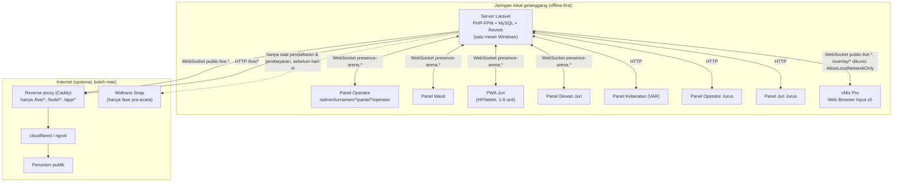
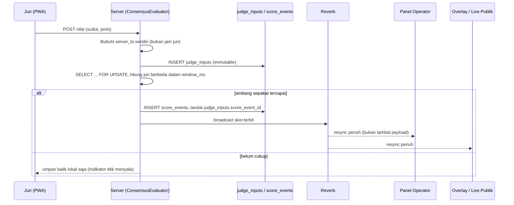

# Arsitektur

## Topologi jaringan



**Kenapa satu mesin.** vMix Pro dan server Laravel berjalan di mesin yang sama (keputusan yang sudah dikonfirmasi di awal proyek). Konsekuensinya: PHP-FPM, MySQL, Reverb, dan lima Browser Input vMix berebut CPU yang sama dipakai encoder streaming. Alamat host, port Reverb, dan port aplikasi semuanya dibaca dari `.env` (NFR-09) supaya bisa dipindah ke mesin terpisah tanpa mengubah kode kalau ternyata berat.

**Kenapa `/overlay/*` dan `/live/*` berlawanan arah.** Keduanya membaca channel WebSocket publik yang sama (`public-live.{arena}`) dan bentuk payload yang sama (`App\Support\Live\StatePartaiPublik`), tapi dijaga arah berlawanan:

- `/overlay/*` dikunci `AllowLocalNetworkOnly` -- **hanya** boleh diakses dari LAN. vMix Browser Input tidak bisa login, jadi pembatasan jaringan adalah satu-satunya pengaman di sini, dan middleware ini secara sengaja tidak pernah lewat `auth`.
- `/live/*` justru dirancang untuk diteruskan tunnel ke internet publik (lihat `docs/TUNNELING.md`), dibatasi `throttle:live` dan cache 1 detik supaya lonjakan penonton tidak membebani mesin scoring.

Mencampur keduanya (mis. meneruskan `/overlay/*` lewat tunnel) berarti panel juri, wasit, dan operator ikut terekspos ke internet -- risiko terbesar dari desain ini, dan sebabnya reverse proxy di `docs/TUNNELING.md` membalas 404 untuk apa pun selain tiga pola yang diizinkan.

## Alur data satu nilai Tanding



Evaluasi konsensus terjadi **saat kedatangan input**, bukan lewat scheduler latar (lihat `App\Support\Scoring\ConsensusEvaluator`). Setiap event yang disiarkan Reverb dianggap sekadar pemicu "sesuatu berubah, ambil ulang" -- panel yang menerima event selalu memanggil endpoint resync (`GET .../state`) alih-alih menambal payload event ke state lokal. Ini menghilangkan kelas bug drift yang lahir dari dua salinan state yang diam-diam tidak sinkron, dan pola yang sama dipakai ulang di overlay (Fase 6) dan live score publik (Fase 5).

## Lapisan kode

```
app/
  Support/
    Scoring/    ConsensusEvaluator, MatchTimer, TanggaHukuman, TandingScoreCalculator, HitunganTeknik
    Jurus/      JurusTimer, JurusScoreCalculator
    Var/        PengajuanProtes, KeputusanVar, PengajuanProtesManajer, KeputusanProtesManajer
    Rekap/      RekapMedali
    Live/       StatePartaiPublik (dipakai overlay MAUPUN live publik, satu sumber kebenaran payload)
  Http/Controllers/
    Admin/      Panel gelanggang & admin (butuh auth + resource key)
    Public/     LiveScoreController (tanpa auth, throttle:live)
    OverlayController  (tanpa auth, AllowLocalNetworkOnly)
  Events/Scoring/   ShouldBroadcastNow -- lihat App\Broadcasting\ArenaChannelAuthorizer untuk channel private
routes/
  web.php     Admin + panel gelanggang (auth)
  live.php    Live score publik, didaftarkan via then: closure, middleware throttle:live
  overlay.php Overlay vMix, didaftarkan via then: closure, middleware AllowLocalNetworkOnly
resources/js/silat.js        Bundel gelanggang: partaiPanel, jurusPanel, silatTimer, store koneksi
resources/js/overlay/connection.js  overlayLive -- dipakai overlay DAN live score publik
```

Prinsip pemisahan: `App\Support\*` berisi ATURAN (diuji lewat TDD, tidak tahu apa-apa soal HTTP). Controller hanya menerjemahkan permintaan jadi pemanggilan `App\Support\*` lalu menyiarkan hasilnya -- pola yang konsisten di seluruh `PartaiScoringController`, `VarController`, dan `JurusScoringController`.
