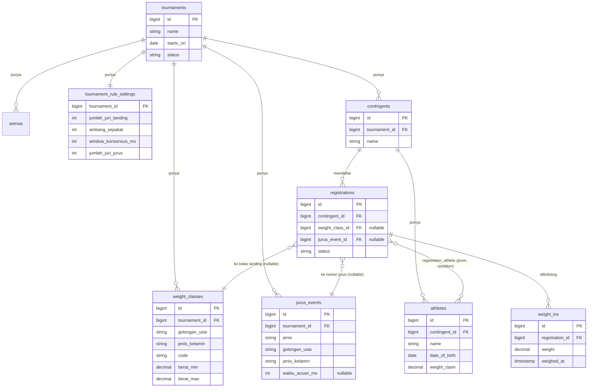
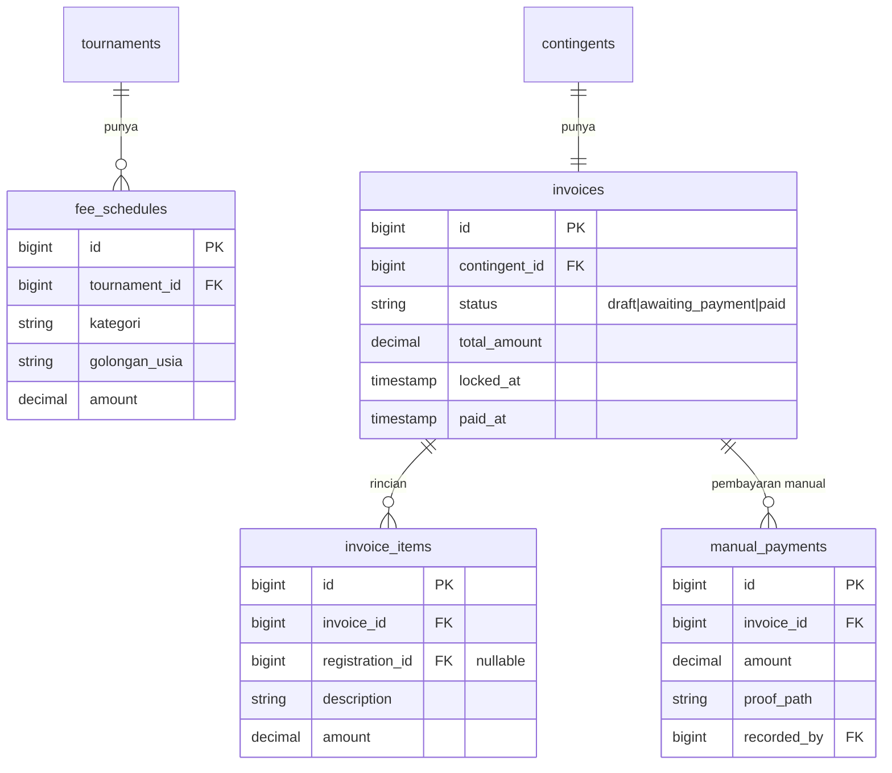
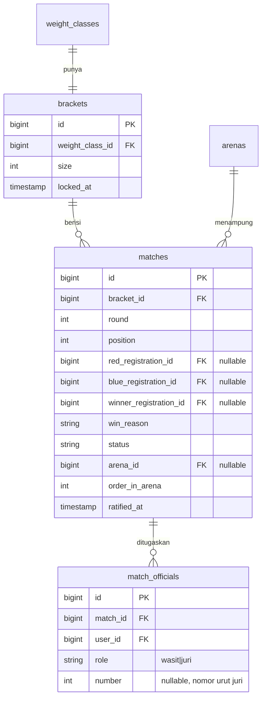
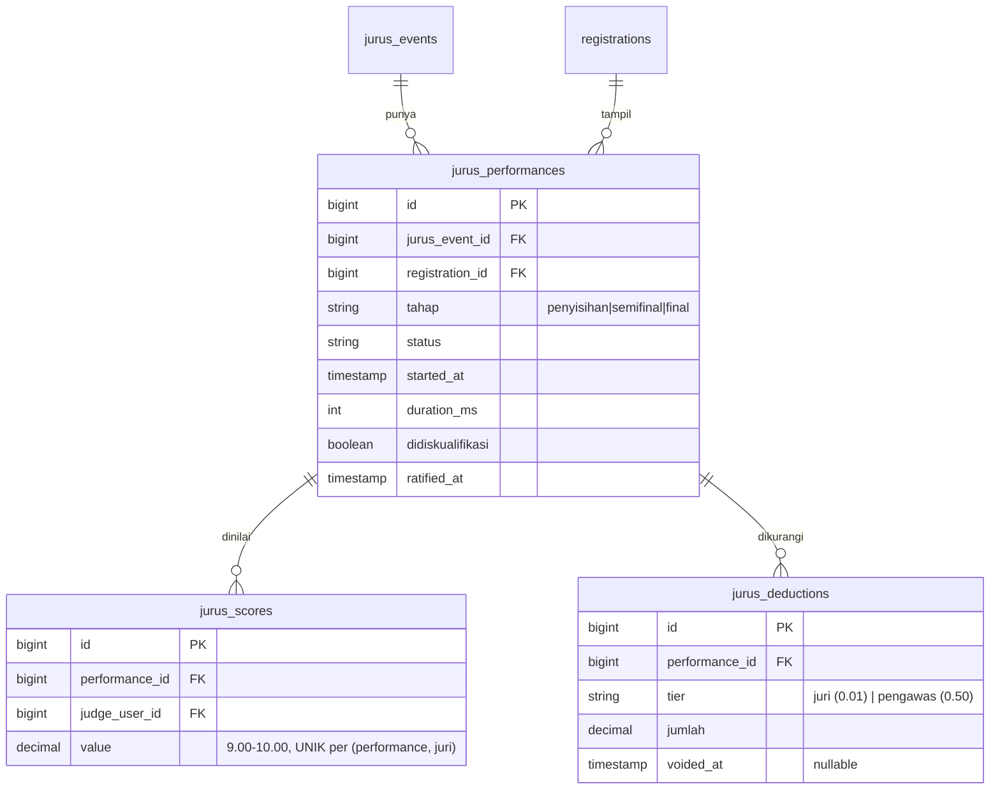
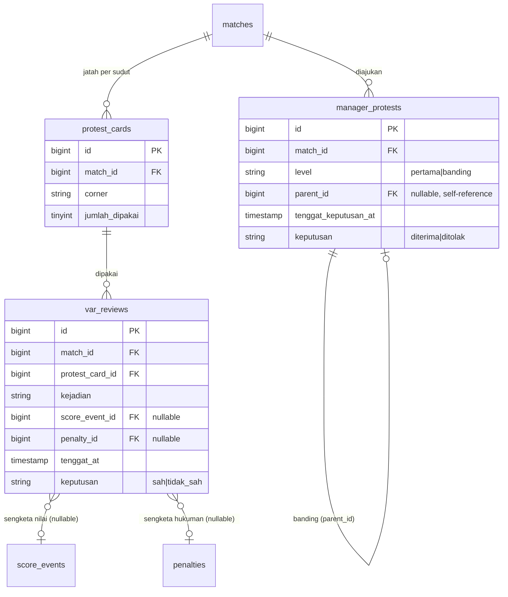

# Diagram Relasi Entitas (ERD)

> Dikelompokkan per domain supaya terbaca. Kolom yang ditulis hanya yang penting untuk memahami relasinya — lihat migrasi di `database/migrations/` untuk daftar kolom lengkap.

## Master turnamen & peserta

## Keuangan

payment_attempts dan payment_events (integrasi Midtrans) belum ada -- menyusul saat kredensial sandbox tersedia (lihat `docs/RENCANA.md` Fase 2b).

## Bagan & jadwal

## Mesin scoring Tanding

```mermaid
erDiagram
    matches ||--o{ match_rounds : punya
    matches ||--o{ judge_inputs : "input mentah"
    matches ||--o{ score_events : "nilai sah"
    matches ||--o{ penalties : hukuman
    judge_inputs }o--o| score_events : "membentuk (score_event_id)"

    match_rounds {
        bigint id PK
        bigint match_id FK
        int round
        string status
        int duration_ms
        int accumulated_ms
        timestamp started_at
    }
    judge_inputs {
        bigint id PK
        bigint match_id FK
        int round
        bigint judge_user_id FK
        string corner
        string point_type
        timestamp server_ts "presisi milidetik"
        bigint score_event_id FK "nullable, terisi bila membentuk nilai"
        string rejected_reason "nullable"
    }
    score_events {
        bigint id PK
        bigint match_id FK
        int round
        string corner
        string point_type
        int value
        timestamp voided_at "nullable"
        string void_reason
    }
    penalties {
        bigint id PK
        bigint match_id FK
        int round
        string corner
        string tier "pembinaan|teguran|peringatan"
        int level
        int points "nullable untuk DQ"
        string violation_level
        timestamp voided_at "nullable"
    }
```

`judge_inputs` tidak pernah di-UPDATE atau DELETE (NFR-05). `score_events`/`penalties` dikoreksi lewat `voided_at`/`voided_by`/`void_reason`, tidak pernah disunting.

## Mesin scoring Jurus

Beda dari `judge_inputs`: `jurus_scores` memakai UPSERT per juri (bukan log immutable) -- lihat penjelasan di README.

## VAR & Protes Manajer

## Sistem (bawaan boilerplate)

`users`, `roles`, `permissions`, `role_has_permissions`, `resources`, `resource_permissions` -- lapisan resource key, lihat [`docs/BOILERPLATE-RESOURCE-KEYS.md`](BOILERPLATE-RESOURCE-KEYS.md). `audit_logs` mencatat tindakan yang mengubah skor, hukuman, atau hasil beserta pelakunya (FR-A-05).
