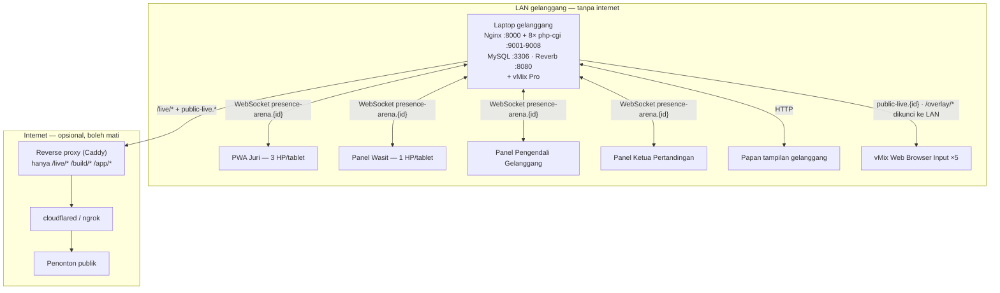
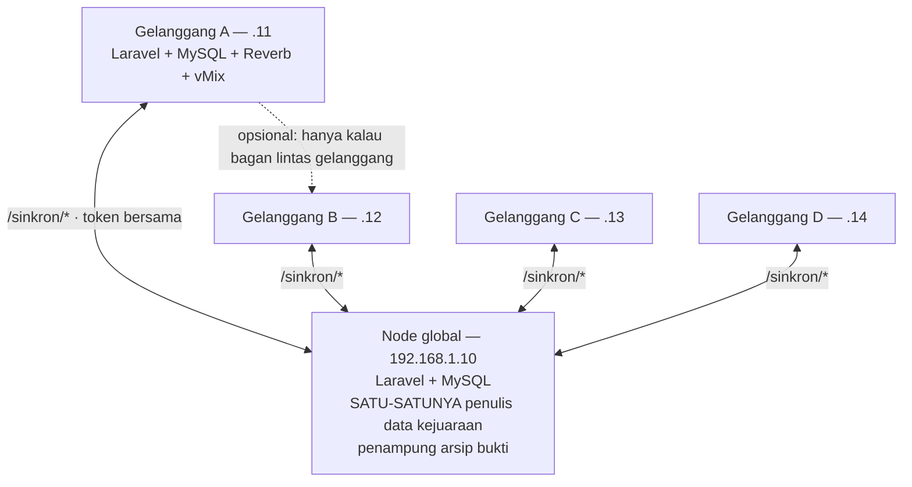

# Panduan Sistem — Menyiapkan Kejuaraan dari Nol sampai Gong Pertama

> **Satu dokumen, satu alur.** Ia menuntun dari "belum ada apa-apa" sampai "partai pertama boleh
> dimulai": memilih bentuk pemasangan, menyiapkan jaringan, memasang mesin, menyetel, menguji,
> dan menjalankan hari-H.
>
> Dokumen lain adalah rincian yang dirujuk dari sini. Kalau isinya pernah bertentangan, **dokumen
> ini yang berlaku** untuk urutan langkah, dan dokumen rincian yang berlaku untuk isi teknis
> masing-masing.
>
> Untuk developer yang ingin memahami kodenya: [`REPOWIKI.md`](REPOWIKI.md).

---

## 0. Peta keputusan

Jawab tiga pertanyaan ini dulu. Jawabannya menentukan bagian mana saja yang perlu dikerjakan.

| Pertanyaan | Kalau **ya** | Kalau **tidak** |
|---|---|---|
| Lebih dari satu gelanggang bertanding bersamaan? | Kerjakan §6 (multi-node) — butuh **jumlah gelanggang + 1** laptop | Lewati §6, satu mesin cukup |
| Memakai vMix/OBS untuk grafis siaran? | Kerjakan §7, nyalakan `OVERLAY_ENABLED` | Biarkan `OVERLAY_ENABLED=false` |
| Skor ditonton dari luar matras (tunnel internet / layar lobi)? | Kerjakan §8, nyalakan `LIVE_SCORE_ENABLED` | Biarkan `LIVE_SCORE_ENABLED=false` |

**Bawaan kedua saklar siaran adalah mati, dan itu pilihan yang benar kalau tidak dipakai.**
Selama salah satunya menyala, tiap tekanan tombol juri mendorong muatan ke dua channel WebSocket,
bukan satu.

Prinsip yang mendasari seluruh dokumen ini:

> **Gelanggang tidak pernah butuh internet.** Panel juri, wasit, operator, dewan juri, timer, mesin
> konsensus, dan overlay siaran berjalan penuh di LAN lokal. Internet hanya dipakai dua hal yang
> keduanya boleh mati tanpa mengganggu gelanggang: menerbitkan live score publik lewat tunnel, dan
> pembayaran pendaftaran pra-acara.

---

## 1. Arsitektur LAN

### 1.1 Satu gelanggang



### 1.2 Banyak gelanggang



Tiap node gelanggang **berdiri sendiri penuh**. Kalau seluruh jaringan antar-laptop mati, yang
berhenti cuma pertukaran data — bukan pertandingannya.

### 1.3 Port dan siapa memakainya

| Port | Proses | Siapa yang menghubunginya |
|---|---|---|
| **8000/TCP** | Nginx (HTTP aplikasi) | HP juri/wasit, panel, papan, vMix, laptop peer |
| **8080/TCP** | Laravel Reverb (WebSocket) | Peramban tiap panel; proxy tunnel kalau live publik dipakai |
| 9001–9008 | Kolam `php-cgi` | **Hanya** Nginx di mesin yang sama — jangan dibuka firewall |
| 3306 | MySQL | Hanya aplikasi di mesin yang sama |

Hanya dua port pertama yang perlu diizinkan firewall.

### 1.4 Empat kelompok alamat, dan arahnya berlawanan

Ini bagian paling penting untuk keamanan, dan paling mudah dirusak tanpa sadar.

| Kelompok | Boleh dijangkau dari | Pengaman |
|---|---|---|
| `/admin/*`, panel gelanggang | **LAN saja** | login + izin per peran |
| `/overlay/*` | **LAN saja** | `AllowLocalNetworkOnly` (403 di luar CIDR lokal) — vMix tidak bisa login, jadi ini satu-satunya pengamannya |
| `/live/*` | **Internet** (kalau dipakai) | `throttle:live` + cache 1 detik |
| `/sinkron/*` | **LAN saja**, dan hanya laptop kejuaraan | token bersama + `AllowLocalNetworkOnly` |

> **Jangan pernah meneruskan seluruh aplikasi lewat tunnel.** Kalau `/overlay/*` dan `/admin/*` ikut
> keluar, siapa pun yang menemukan URL-nya bisa membuka panel juri dan mengubah skor pertandingan
> yang sedang berjalan. Reverse proxy di §8 membalas 404 untuk semua path selain tiga yang
> diizinkan — itu bukan kehati-hatian berlebih, itu satu-satunya yang menahan.

### 1.5 Jaringan venue

- **Kabel untuk laptop gelanggang, WiFi untuk HP juri.** Laptop yang menjalankan server dan vMix
  sebaiknya tidak bergantung pada WiFi yang sama dengan penonton.
- **Reservasi DHCP wajib** untuk tiap laptop gelanggang dan node global. Alamat yang berubah di
  tengah acara berarti seluruh HP juri harus mengetik ulang alamatnya, dan tiap entri
  `SINKRON_PEER` di lima laptop jadi salah.
  **Kalau IP tetap berpindah di tengah pertandingan, tidak ada pemulihan otomatis.** Alamat di
  bilah alamat adalah satu-satunya hal yang menyebut server, dan server tidak bisa memberitahu
  perangkat yang permintaannya sudah tidak sampai. Tiap juri mengetik ulang alamat baru, lalu
  menambahkan ulang ikon PWA-nya.

  Yang pulih sendiri sesudah itu: WebSocket (mengikuti alamat yang dibuka — tidak perlu
  `npm run build`) dan seluruh skor yang sudah terkirim. Yang **tidak** pulih: tekanan yang masih
  tertahan di antrean offline. Antrean itu hidup di `localStorage`, yang terikat origin, jadi
  alamat baru tidak melihat antrean alamat lama — dan isinya dibuang sendiri setelah lima menit.
  Nilai yang terlewat dicatat lewat **Panel Kendali → "Catat susulan babak N"**.

  Yang ikut putus bersamaan dan sering baru ketahuan belakangan: `APP_URL` (§4.1b), entri
  `SINKRON_PEER` di laptop **lain** yang menunjuk node ini, dan Web Browser Input vMix.
  `REVERB_PUBLISH_HOST` tidak terkena — ia loopback (§4.2).

- **Router venue harus mengizinkan lalu lintas antar-klien** (beberapa WiFi tamu memblokirnya —
  isolasi klien / AP isolation). Kalau aktif, HP juri tidak akan pernah bisa menjangkau server
  walau keduanya di jaringan yang sama.
- Jangan menggantungkan gelanggang pada WiFi yang juga dibagikan ke penonton.

---

## 2. Daftar kebutuhan

### 2.1 Perangkat keras per gelanggang

| Barang | Jumlah | Catatan |
|---|---|---|
| Laptop server | 1 | 6 inti fisik atau lebih; ia menjalankan Nginx + MySQL + Reverb **dan** vMix sekaligus |
| HP/tablet juri | 3 | Tanding. Layar 375 px sudah diuji |
| HP/tablet wasit | 1 | |
| Perangkat Pengendali Gelanggang | 1 | Boleh laptop server itu sendiri |
| Perangkat Ketua Pertandingan | 1 | Meninjau nilai, mengesahkan hasil, memutus protes |
| Layar papan skor gelanggang | 1 | Boleh monitor kedua laptop server |
| Power bank / stopkontak | secukupnya | Panel juri menyala sepanjang hari |

Tambahan kalau lebih dari satu gelanggang: **satu laptop node global** (tidak perlu vMix, tidak
melayani gelanggang mana pun).

### 2.2 Perangkat lunak (butuh internet, sekali saja)

| Perangkat lunak | Versi | Catatan |
|---|---|---|
| PHP | 8.3+ | Ekstensi `pdo_mysql`, `mbstring`, `intl`, `gd`, `fileinfo`. Paket ZIP resmi Windows sudah membawa `php-cgi.exe` |
| Nginx | 1.24+ | ZIP dari nginx.org, cukup diekstrak |
| Composer | 2.x | |
| Node.js | 20+ | Untuk `npm install` dan build aset |
| MySQL | 8.0+ | XAMPP, Laragon, atau instalasi mandiri |
| Git | terbaru | |

> **PHP dan `php-cgi.exe` harus dari instalasi yang SAMA.** Dua instalasi berarti dua `php.ini`:
> ekstensi yang aktif di baris perintah belum tentu aktif di yang melayani web, dan galatnya baru
> muncul sebagai halaman kosong di tengah kejuaraan. `jalankan-server.ps1` mengambil `php-cgi.exe`
> dari folder yang sama dengan `php` di PATH, jadi ini terjaga sendiri selama tidak dipaksa lain.

---

## 3. Pemasangan satu mesin

### 3.1 Jalur cepat

Untuk laptop yang belum pernah dipasang, dan yang setelannya sudah diketahui:

```powershell
git clone <url-repo> D:\digiscoring-prototype
cd D:\digiscoring-prototype
composer install
npm install
```

Buat dua database:

```sql
CREATE DATABASE digiscoring      CHARACTER SET utf8mb4 COLLATE utf8mb4_unicode_ci;
CREATE DATABASE digiscoring_test CHARACTER SET utf8mb4 COLLATE utf8mb4_unicode_ci;
```

Lalu serahkan sisanya ke skrip penyiap — ia bertanya satu per satu, menulis `.env`, memigrasikan,
dan menyalakan server:

```powershell
.\scripts\server\siapkan-gelanggang.ps1
```

Menjalankannya ulang aman: yang sudah benar tinggal ditekan Enter. Tanpa tanya sama sekali (untuk
memasang ulang laptop yang setelannya sudah diketahui):

```powershell
.\scripts\server\siapkan-gelanggang.ps1 -Peran gelanggang -Node gelanggang-a -Arena A -Token abc123 -Peer 'global|http://192.168.1.10:8000'
```

Yang **tidak** dilakukan skrip itu, dan disengaja: tidak pernah menghapus data (`migrate`
dijalankan, `migrate:fresh` tidak), tidak menyeed kejuaraan, tidak memangkas riwayat juri.

### 3.2 Jalur manual

Kalau ingin mengerjakannya sendiri langkah demi langkah, ikuti
[`INSTALASI-LAN.md`](INSTALASI-LAN.md) §2–§5. Ringkasnya:

```powershell
copy .env.example .env
php artisan key:generate
# isi .env (lihat §4 di bawah)
php artisan migrate --seed
php artisan storage:link
npm run build
```

> **Kalau memigrasikan basis data yang sudah berisi riwayat:** konversi kunci ke ULID memakan
> sekitar **sepuluh menit per seratus ribu baris `judge_inputs`**. Jangan dijalankan di sela
> pertandingan. Pemasangan baru di basis data kosong tidak terpengaruh.

---

## 4. Konfigurasi wajib

### 4.1 Tiga kunci Reverb — tanpa ini seluruh panel berhenti di "Terputus"

`.env.example` sengaja mengosongkannya. Cetak nilai acaknya, tempel ke `.env`:

```powershell
php -r "printf('REVERB_APP_ID=%d%sREVERB_APP_KEY=%s%sREVERB_APP_SECRET=%s%s', random_int(100000,999999), PHP_EOL, bin2hex(random_bytes(10)), PHP_EOL, bin2hex(random_bytes(10)), PHP_EOL);"
```

> **Jangan memakai `php artisan reverb:install`.** Perintah itu menempelkan blok Reverb baru di
> akhir `.env` tanpa membuang baris lama, dan nilai terakhirlah yang dipakai Laravel — artinya
> `VITE_REVERB_HOST` yang sengaja dikosongkan tertimpa `localhost` di baris bawahnya, dan seluruh
> HP juri kehilangan WebSocket tanpa pesan galat yang jelas. (`localhost` di HP menunjuk ke HP itu
> sendiri, bukan ke server.)

### 4.1b `APP_URL` — bukan syarat akses, tapi tetap harus benar

**HP juri tidak butuh `APP_URL` untuk bisa membuka aplikasi.** Yang menentukan itu Nginx mengikat
`0.0.0.0`, firewall (§4.6), dan HP ada di jaringan yang sama. Laravel melayani `Host` apa pun yang
datang, dan tautan yang dirender di dalam satu permintaan mengikuti alamat yang sedang dibuka
peramban — termasuk alamat vMix yang dicetak halaman Overlay Siaran.

Yang membacanya cuma tiga tempat, dan hanya satu yang menggigit di lapangan: `config/filesystems.php`
menyusun URL disk `public` sebagai `APP_URL/storage/...` — absolut. `User::avatarUrl()` memakainya,
dan komponen foto terpasang di kepala **tiap** halaman, panel juri termasuk. Kalau `APP_URL` masih
`127.0.0.1` sementara juri membuka lewat IP LAN, `src` fotonya menunjuk ke HP itu sendiri.

Gejalanya selektif, dan itu yang membuatnya lolos saat uji coba: akun tanpa foto unggahan jatuh ke
SVG inisial berupa `data:` URI yang tidak menyentuh `APP_URL` sama sekali. Yang rusak hanya akun
yang fotonya pernah diunggah — biasanya panitia, bukan juri.

```env
APP_URL=http://192.168.1.11:8000
```

Isi dengan alamat **yang benar-benar diketik orang** — tidak harus IP; kalau venue punya hostname
lokal, itu yang dipakai. Sesudah mengubahnya, `php artisan config:clear`.

> `APP_URL` yang tertinggal di alamat jaringan sebelumnya adalah kegagalan diam, bukan galat. Ia
> satu alasan lagi kenapa reservasi DHCP (§1.5) bukan kemewahan.

### 4.2 Tiga alamat Reverb yang mudah tertukar

| Kunci | Isi | Kenapa |
|---|---|---|
| `REVERB_PUBLISH_HOST` | `127.0.0.1` | Alamat yang dipakai **aplikasi** untuk mendorong siaran. Lewat IP LAN sendiri satu dorongan diukur 15,7 ms; lewat loopback 1,8 ms — selisih yang menempel di tiap tekanan tombol juri |
| `VITE_REVERB_HOST` | **kosong** | Peramban menyambung ke alamat yang sedang dibukanya sendiri. Diisi, alamatnya terpanggang ke aset saat `npm run build`, dan IP yang berubah memutus seluruh HP juri sekaligus |
| `REVERB_HOST` | `127.0.0.1` | Cadangan; hanya dipakai kalau `REVERB_PUBLISH_HOST` dikosongkan |

Isi `VITE_REVERB_HOST` **hanya** kalau Reverb sengaja dijalankan di mesin yang berbeda dari yang
melayani HTTP — dan sesudahnya `npm run build` wajib.

> **Kejuaraan banyak gelanggang tidak mengubah satu pun dari ketiganya.** Yang menentukan bukan
> jumlah laptop, melainkan apakah Reverb berjalan di mesin yang sama dengan proses PHP yang
> mendorong siaran — dan di arsitektur ini selalu iya: tiap laptop menjalankan tumpukannya sendiri
> secara penuh (§6.1). Jadi `REVERB_PUBLISH_HOST=127.0.0.1` di **semua** laptop, termasuk node
> global, dan `VITE_REVERB_HOST` tetap kosong di semuanya.
>
> Node A tidak pernah mendorong siaran ke Reverb milik node B. Yang lintas laptop adalah
> **sinkron**, dan itu HTTP tarik lewat `/sinkron/*` — bukan WebSocket.
>
> Mengisi `REVERB_PUBLISH_HOST` dengan IP LAN mesin sendiri bukan galat yang terlihat: siarannya
> tetap sampai, hanya lewat jalan memutar. Yang terlihat cuma panel yang terasa sedikit lebih
> lambat, di setiap tekanan, sepanjang hari.

### 4.3 Empat saklar fitur

```env
OVERLAY_ENABLED=false               # nyalakan kalau memakai vMix/OBS
LIVE_SCORE_ENABLED=false            # nyalakan kalau skor ditonton dari luar matras
PENDAFTARAN_LEWATI_VERIFIKASI=false # nyalakan kalau berkas diurus manual di meja sekretariat
PENDAFTARAN_LEWATI_PEMBAYARAN=false # nyalakan kalau uang diurus manual
```

Dua yang pertama menentukan apakah channel `public-live.*` ikut disiarkan. Panel juri, wasit,
operator, dan ketua **tidak terpengaruh sama sekali** oleh keduanya.

Halaman turnamen, medali, dan bagan publik tetap hidup apa pun saklarnya — tidak satu pun memakai
WebSocket, jadi mematikannya tidak menghemat apa-apa sementara penonton tetap butuh melihat hasil.

Dua yang terakhir: saat dinyalakan, `verified_by` dibiarkan **kosong** (tidak ada manusia yang
memutuskan, dan mengisinya akan memalsukan jejak audit), rutenya tetap terdaftar, dan tagihan tetap
dibuat — yang dimatikan adalah paksaannya, bukan fiturnya.

> **Sesudah mengubah saklar mana pun: `php artisan config:clear`.** Kalau `php artisan optimize`
> sudah dijalankan, konfigurasinya sedang di-cache dan suntingan `.env` tidak berlaku sama sekali.

### 4.4 `php.ini`

Lima setelan yang tidak punya nilai bawaan yang cocok untuk kejuaraan, dan semuanya baru terasa
akibatnya di hari-H:

```ini
; Foto struk dan akta dari kamera HP rutin 2-5 MB. Yang berlaku adalah yang
; TERKECIL antara setelan ini dan aturan aplikasi (4 MB).
upload_max_filesize = 8M
post_max_size = 16M

; Wajib Off. Kalau On, unggahan yang kelebihan membalas peringatan PHP mentah
; beserta angka konfigurasi server, bukan halaman galat aplikasi.
display_errors = Off
log_errors = On

; Tanpa OPcache, tiap permintaan mengompilasi ulang seluruh berkas yang
; dipakainya — puluhan milidetik di setiap tekanan tombol.
zend_extension = opcache
opcache.enable = 1
opcache.memory_consumption = 256
opcache.max_accelerated_files = 20000
opcache.validate_timestamps = 0    ; kembalikan ke 1 kalau kode sedang disunting

; Nginx sudah mengirim SCRIPT_FILENAME lengkap. Dibiarkan 1, tebakan PHP bisa
; menjalankan berkas yang bukan diminta.
cgi.fix_pathinfo = 0
```

Sesudah menyuntingnya: `.\scripts\server\hentikan-server.ps1` lalu `.\scripts\server\jalankan-server.ps1`.

### 4.5 Setelan mode hari-H

```env
APP_ENV=production
APP_DEBUG=false
SESSION_DRIVER=file    # boleh, kalau seluruh kejuaraan di satu mesin
CACHE_STORE=file
```

`APP_DEBUG=true` membuat Laravel mengumpulkan jejak tiap query sepanjang permintaan, dan ia
menayangkan isi `.env` ke siapa pun yang memicu galat.

Lalu:

```powershell
php artisan optimize
```

> **Selama konfigurasi di-cache, jangan menjalankan `php artisan test`.** Laravel tidak lagi
> membaca variabel lingkungan mana pun — termasuk nama database uji di `phpunit.xml` — sehingga
> seluruh uji menunjuk ke database sungguhan dan `RefreshDatabase` menghapus isinya.
> `tests/TestCase.php` menolak berjalan dalam keadaan itu, jadi yang muncul galat, bukan data yang
> hilang. Urutannya: `php artisan optimize:clear` → uji → `php artisan optimize` lagi.
> **`optimize:clear`, bukan `config:clear`.**

### 4.6 Firewall Windows

Sekali saja seumur mesin, dari **PowerShell sebagai Administrator**:

```powershell
New-NetFirewallRule -DisplayName "Digiscoring HTTP"   -Direction Inbound -LocalPort 8000 -Protocol TCP -Action Allow
New-NetFirewallRule -DisplayName "Digiscoring Reverb" -Direction Inbound -LocalPort 8080 -Protocol TCP -Action Allow
```

Tanpa ini **tidak satu pun HP bisa membuka aplikasinya**, sementara dari mesin server semuanya
terlihat normal — kegagalannya baru ketahuan saat orang sudah berkumpul. Memeriksanya:

```powershell
Get-NetFirewallRule -DisplayName "Digiscoring*" | Select-Object DisplayName, Enabled
```

Dua baris, keduanya `True`.

---

## 5. Menjalankan server

**Dua proses, dua jendela PowerShell.** Jangan memakai `composer run dev` untuk hari-H.

```powershell
# Jendela 1 — Nginx + kolam 8 php-cgi. Mencetak alamat yang harus dibuka HP juri.
.\scripts\server\jalankan-server.ps1

# Jendela 2 — Reverb, di jendela sendiri supaya lognya terlihat sepanjang acara.
php artisan reverb:start --host=0.0.0.0 --port=8080
```

Atau sekaligus: `.\scripts\server\jalankan-server.ps1 -DenganReverb`.

Mematikan semuanya: `.\scripts\server\hentikan-server.ps1`.

**`--host=0.0.0.0` wajib untuk Reverb.** Tanpa itu ia hanya menerima koneksi dari mesin itu
sendiri, dan HP di LAN tidak akan bisa menyambung sama sekali.

**`php artisan queue:listen` TIDAK dibutuhkan.** Tidak ada satu pun pekerjaan antrean di aplikasi
ini — seluruh event gelanggang memakai `ShouldBroadcastNow`, artinya siarannya didorong di dalam
permintaan itu juga. Menjalankannya tidak salah, hanya tidak ada yang dikerjakannya.

**`php artisan schedule:work` juga tidak dijalankan di mesin gelanggang saat hari-H.** Isinya
sengaja hal-hal yang boleh tertunda; tidak ada satu pun yang jadi syarat pertandingan berjalan.

### Kenapa bukan `php artisan serve`

Server bawaan PHP melayani satu permintaan pada satu waktu di Windows. Diukur di satu mesin 6 inti,
endpoint `overlay/state` yang sama, p50:

| | 1 permintaan | 5 bersamaan | 10 bersamaan |
|---|---|---|---|
| `php artisan serve` | 69 ms | 180 ms | 337 ms |
| Nginx + 8 php-cgi | 71 ms | 91 ms | 108 ms |

Sendirian sama cepatnya — itu sebabnya masalahnya tidak pernah terlihat saat mencoba sendirian.

**Jumlah pekerja adalah batasnya.** Di `panel/state` (muatan terberat), Nginx 8 pekerja: datar
sampai 8 bersamaan (~276 ms), lalu naik dua kali lipat di 16 (~496 ms). Kalau gelanggang punya
lebih dari delapan layar yang menarik keadaan berbarengan:

```powershell
.\scripts\server\jalankan-server.ps1 -Pekerja 12
```

`php artisan serve` tetap memadai untuk memasang, menguji, dan latihan satu-dua orang — **asalkan
diberi `--host=0.0.0.0`**. Tanpa itu halamannya terbuka sempurna di mesin server sementara HP di
jaringan yang sama tidak mendapat apa-apa, dan gejalanya sama persis dengan firewall yang
memblokir.

> **Pastikan tidak ada `php artisan serve` lama yang masih hidup di port yang sama.** Windows
> mengizinkan dua proses mengikat port yang sama, dan yang lebih dulu mengikat itulah yang
> melayani — Nginx terlihat hidup, halamannya terbuka, tapi semua permintaan dilayani server lama
> yang berbaris.
>
> ```powershell
> Get-NetTCPConnection -LocalPort 8000 -State Listen | ForEach-Object { (Get-Process -Id $_.OwningProcess).ProcessName }
> ```

---

## 6. Multi-gelanggang

Kerjakan bagian ini hanya kalau lebih dari satu gelanggang bertanding bersamaan.

### 6.1 Bentuknya

**Gelanggang + 1 laptop.** Empat gelanggang berarti lima mesin: empat node gelanggang (Laravel +
MySQL + Reverb + vMix) dan satu **node global** (Laravel + MySQL, tidak melayani gelanggang mana
pun).

Node global adalah **satu-satunya yang boleh menulis data kejuaraan** — atlet, kontingen,
pendaftaran, bagan, jadwal, pengguna, peran. Aturan satu penulis itulah yang menggantikan resolusi
konflik: keadaan bentroknya dibuat tidak bisa terjadi, bukan dipecahkan sesudah terjadi.

### 6.2 Token sinkron

Token di sini adalah **rahasia yang kamu buat sendiri** — bukan API key, bukan token bawaan
Laravel. Ia berfungsi seperti kata sandi antar-laptop. Buat **sekali**, sebelum memasang laptop
pertama:

```powershell
php -r "echo bin2hex(random_bytes(32)), PHP_EOL;"
```

Pakai **token yang sama di semua laptop** — dengan begitu tidak ada yang perlu dicocokkan satu per
satu.

> LAN gelanggang juga dipakai perangkat penonton dan panitia, dan endpoint sinkron menyajikan
> seluruh riwayat pertandingan. Jangan memakai kata yang mudah ditebak.
>
> **Token kosong berarti endpoint sinkron MATI, bukan terbuka.** Laptop yang belum dikonfigurasi
> tidak diam-diam menyajikan isi basis datanya ke jaringan.

### 6.3 Setelan tiap laptop

Kelima kunci sudah ada di `.env.example` beserta penjelasannya, terisi nilai bawaan satu-mesin.
`siapkan-gelanggang.ps1` menanyakannya lalu menulisnya sendiri; blok di bawah hanya perlu diisi
dengan tangan kalau memasang tanpa skrip itu.

```dotenv
# Node gelanggang A  (192.168.1.11)
SINKRON_PERAN=gelanggang
SINKRON_NODE=gelanggang-a
SINKRON_ARENA=A
SINKRON_TOKEN=RAHASIA
SINKRON_PEER="global|http://192.168.1.10:8000|RAHASIA"

# Node global  (192.168.1.10)
SINKRON_PERAN=global
SINKRON_NODE=global
SINKRON_ARENA=
SINKRON_TOKEN=RAHASIA
SINKRON_PEER="gelanggang-a|http://192.168.1.11:8000|RAHASIA,gelanggang-b|http://192.168.1.12:8000|RAHASIA"
```

`SINKRON_ARENA` memakai **kode** gelanggang (`A`, `B`), bukan id — id auto-increment berbeda antar
basis data.

Nama peer `global` bukan sekadar label: pendorong arsip mencarinya dengan nama itu untuk tahu ke
mana bukti partai dikirim.

Tiap laptop gelanggang cukup mengenal **node global** sebagai peer. Mengenal gelanggang lain hanya
perlu kalau bagannya memang lintas gelanggang dan hasilnya ingin ditarik langsung.

Sesudah mengubah `.env`: `php artisan config:clear`.

### 6.4 Menarik data

Buka menu **Sinkron Gelanggang**, tekan **Tarik dari peer ini**. Halaman memanggil peer satu
potongan pada satu waktu sampai selesai; bilah kemajuannya bergerak di antara potongan.
Perulangannya sengaja di browser — satu permintaan yang menarik sampai habis akan menahan satu dari
delapan proses `php-cgi` selama seluruh penarikan.

### 6.5 Yang berubah sifatnya, dan yang harus dikunci sebelum hari-H

- **Panel Ketua Pertandingan** melihat seluruh gelanggang, tapi sejauh sinkron terakhir — bukan
  keadaan langsung.
- **Konflik penugasan aparat lintas gelanggang** baru terdeteksi setelah sinkron. **Kunci
  penugasan aparat di node global sebelum hari-H.**
- **Rekap medali** hanya lengkap setelah semua node ditarik.
- **Bagan lintas gelanggang ditahan sistem.** Pengendali yang mencoba menayangkan partai yang
  hulunya belum ditarik mendapat pesan yang menyebut gelanggang mana yang ditunggu.
- **Pemenang naik sendiri melintasi batas gelanggang.** Begitu hasil partai hulu tiba, laptop
  pemilik partai berikutnya mengisi sudutnya dengan aritmetika bagan yang sama. Partai yang belum
  dijadwalkan dimiliki node global, dan node global yang mengisinya.
- **Node global meneruskan.** Hasil dari gelanggang A sampai ke gelanggang B lewat node global;
  tiap laptop gelanggang cukup mengenal node global sebagai peer. Gelanggang asal akan menerima
  kembali barisnya sendiri dan menolaknya — angka "ditolak" di ringkasan penarikan itu wajar.
- **Perubahan sesudah pemasangan ikut menyusul**, termasuk bagan yang baru disusun, pendaftaran
  baru beserta atletnya, akun dan perannya. Penghapusan pun: partai yang dibongkar hilang dari
  gelanggang beserta nilai dan hukumannya.

Rincian: [`MULTI-GELANGGANG.md`](MULTI-GELANGGANG.md) dan [`ARSIP-BUKTI.md`](ARSIP-BUKTI.md).

---

## 7. Overlay vMix

1. `OVERLAY_ENABLED=true` di `.env`, lalu `php artisan config:clear`.
2. Di vMix, tambahkan **Web Browser Input** untuk tiap grafis yang dipakai:
   `/overlay/scorebug`, `/overlay/athlete`, `/overlay/breakdown`, `/overlay/result`.
3. Alamatnya memakai IP LAN mesin gelanggang, bukan `localhost`, kecuali vMix benar-benar di mesin
   yang sama.

`/overlay/*` dikunci `AllowLocalNetworkOnly` dan membalas **403** dari luar CIDR lokal. Bawaannya
sudah mencakup seluruh RFC 1918 (`10.0.0.0/8`, `172.16.0.0/12`, `192.168.0.0/16`), jadi biasanya
tidak perlu disetel. Kalau perlu: `OVERLAY_ALLOWED_CIDRS`.

Saat saklarnya mati, halamannya tidak berubah jadi 404 — yang muncul halaman yang menjelaskan
keadaannya sendiri, lengkap dengan nama kunci `.env` yang perlu diubah, karena yang membacanya
operator IT yang sedang berdiri di depan vMix.

---

## 8. Live score publik lewat tunnel

1. `LIVE_SCORE_ENABLED=true`, lalu `php artisan config:clear`. Tanpa ini tunnelnya menyala tapi
   isinya tidak ada.
2. Jalankan reverse proxy (Caddy) yang **hanya** meneruskan tiga hal, dan membalas 404 untuk sisanya:

| Path | Diteruskan ke | Untuk |
|---|---|---|
| `/live/*` | `localhost:8000` | Halaman dan endpoint state live score |
| `/build/*` | `localhost:8000` | Aset Vite (CSS/JS/font) supaya tampilannya tidak polos |
| `/app/*` | `localhost:8080` | WebSocket Reverb — channel `public-live.*` |

3. Arahkan cloudflared/ngrok ke proxy itu, **bukan** ke port aplikasi Laravel.

`/broadcasting/auth` **sengaja tidak diteruskan** — path itu hanya dipakai channel private/presence
yang memang tidak pernah boleh keluar dari LAN. Channel publik tidak membutuhkannya.

Contoh Caddyfile lengkap: [`TUNNELING.md`](TUNNELING.md).

---

## 9. Menguji sebelum hari-H

Sediakan dulu data ujinya — kejuaraan simulasi lengkap dengan akun tiap peran, bagan, dan jadwal:

```powershell
php artisan silat:simulasi
```

> **Buang kejuaraan simulasi ini sebelum hari-H** lewat menu Kejuaraan (hapus permanen), supaya
> tidak ikut terbaca di live score publik dan rekap medali bersama kejuaraan sungguhan.

### 9.1 Daftar periksa satu mesin

- [ ] Buka `http://<IP-server>:8000` **dari HP yang tersambung ke WiFi venue**, bukan dari mesin server
- [ ] Login sebagai juri, buka panel juri, indikator koneksi **hijau ("Tersambung")**
- [ ] Kirim satu nilai percobaan dari 2 HP berbeda dalam window konsensus (bawaan 2 detik; simulasi memakai 5) — nilai terbit di panel operator
- [ ] **Tekanan beruntun.** Dua juri menekan teknik sama bergantian cepat, lalu berhenti. Tiap titik juri padam kira-kira dua detik sejak tekanannya **sendiri**, tidak diperpanjang tekanan juri lain; titik yang tekniknya baru terbit jadi nilai padam seketika
- [ ] Satu juri menekan teknik sama dua kali beruntun — titiknya berkedip ulang, bukan diam
- [ ] Cabut WiFi satu HP juri di tengah percobaan, sambungkan lagi — panel resync sendiri tanpa reload manual
- [ ] Matikan dan nyalakan ulang `reverb:start` — seluruh panel pulih ke state benar. Selama Reverb mati, tombol nilai tetap membalas dalam hitungan detik (bukan menggantung)
- [ ] Ukur bebannya: `.\scripts\ukur-beban.ps1` — baca p50 pada 5 dan 10 bersamaan dibanding p50 pada 1

### 9.2 Tambahan untuk multi-gelanggang

- [ ] `php artisan silat:kesehatan` di tiap laptop — ketiga metriknya hijau
- [ ] Menu **Sinkron Gelanggang**: tiap peer terdaftar, tidak ada peringatan token
- [ ] Tarik dari node global di tiap laptop gelanggang — bagan dan jadwalnya masuk
- [ ] Sahkan satu partai percobaan, lalu `php artisan silat:arsip` — partainya **diterima**, bukan menunggu
- [ ] Coba tayangkan partai yang hulunya berjalan di gelanggang lain sebelum ditarik — **harus ditolak**, dengan pesan yang menyebut nama gelanggangnya
- [ ] Tarik dari gelanggang itu, tayangkan lagi — kali ini lolos
- [ ] Matikan node global, sahkan satu partai lagi — pengesahannya **tetap berhasil**, partainya menumpuk di antrean arsip. Hidupkan lagi, `silat:arsip --dorong`, antreannya habis

Latihan dengan orang sungguhan: [`SIMULASI-LAPANGAN.md`](SIMULASI-LAPANGAN.md).

---

## 10. Kesiapan data — H-7 sampai H-1

Teknis saja tidak cukup. Yang berikut ini memblokir pertandingan kalau belum beres, dan tidak ada
yang bisa memperbaikinya cepat di pagi hari-H.

- [ ] Kejuaraan, tarif, dan setelan peraturan dibuat ([`PANDUAN-WORKFLOW.md`](PANDUAN-WORKFLOW.md), [`PARAMETER-PERATURAN.md`](PARAMETER-PERATURAN.md))
- [ ] Pendaftaran ditutup, diverifikasi, tagihan lunas (atau saklar §4.3 dinyalakan sadar)
- [ ] Timbang badan selesai
- [ ] **Bagan dikunci** untuk tiap kelas yang bertanding — setelah dikunci, penyusunan ulang wajib beralasan dan tercatat di jejak audit
- [ ] Jadwal partai ditetapkan ke tiap gelanggang
- [ ] Akun juri dibuat massal per gelanggang, kredensial pendek dan mudah diketik di HP
- [ ] **Tiap gelanggang punya Pengendali Gelanggang.** Gelanggang tanpa pengendali **tidak bisa memulai babak sama sekali.** Kalau baru memasang pembaruan: `php artisan silat:pindah-pengendali` — ia memberi peran itu ke tiap Operator IT yang sudah memegang gelanggang, lalu melaporkan yang masih kosong
- [ ] Penugasan aparat dikunci di node global (multi-gelanggang, §6.5)
- [ ] Daftar kredensial juri per gelanggang dicetak untuk dibagikan pagi hari-H
- [ ] Kejuaraan simulasi dibuang

---

## 11. Pagi hari-H

Urutannya, dan urutan ini penting:

1. **Sambungkan laptop ke WiFi/kabel venue lebih dulu**, baru jalankan servernya. Alamat yang
   dicetak skrip diambil dari adapter yang sedang punya gerbang bawaan.
2. `.\scripts\server\jalankan-server.ps1` — catat alamat LAN yang dicetak di baris terakhir.
3. `php artisan reverb:start --host=0.0.0.0 --port=8080` di jendela sendiri.
4. Proxy tunnel, **hanya kalau** live score publik dipakai.
5. Multi-gelanggang: tarik dari node global di tiap laptop gelanggang.
6. Pengendali Gelanggang membuka Panel Kendali di tiap gelanggang.
7. Juri dan wasit login di HP masing-masing. **Yang bertugas di satu gelanggang mendarat langsung
   di panelnya** — tidak lewat dashboard. Tambahkan ke layar utama (PWA): alamatnya per
   **gelanggang**, jadi ikonnya tidak pernah basi saat jadwal berganti.
8. **Uji satu nilai percobaan sebelum partai pertama sungguhan** — indikator koneksi hijau di
   seluruh perangkat.

Pergantian partai dipegang **satu perangkat**: Pengendali Gelanggang. Begitu ia memindahkan jadwal,
panel juri, wasit, papan, dan ketua ikut berpindah sendiri — tidak ada perangkat lain yang
perlu disentuh.

Alur operasional lengkap per peran: [`PANDUAN-OPERASIONAL.md`](PANDUAN-OPERASIONAL.md).

---

## 12. Selama acara

### Pemantauan

```powershell
php artisan silat:kesehatan
```

Tiga metrik. Ambangnya disetel dari pengukuran satu hari pertandingan empat gelanggang; alasan tiap
angka ada di `config/pemantauan.php`, dan kalau perlu digeser, kuncinya (`PANTAU_*`) sudah tercatat
sebagai komentar di `.env.example`.

> Seluruh perintah `php artisan silat:*` dan `resource:*` — opsinya, kapan dipakai, dan apa yang
> terjadi kalau salah pakai — ada di [PERINTAH-ARTISAN.md](PERINTAH-ARTISAN.md).

| Metrik | Kuning | Merah | Artinya |
|---|---|---|---|
| Waktu endpoint state | 500 ms | 900 ms | Panel mulai tertinggal dari matras — pertimbangkan menaikkan `-Pekerja` |
| Baris `judge_inputs` | 150.000 | 300.000 | Volume basis data; pangkas riwayat partai yang arsipnya sudah **diterima** |
| Partai belum terarsip | 5 | 15 | Node global mungkin tidak terjangkau — periksa jaringan, lalu `silat:arsip --dorong` |

### Yang JANGAN dilakukan saat acara berjalan

- **Jangan** menjalankan migrasi ULID di sela pertandingan (§3.2).
- **Jangan** menjalankan `php artisan test` di mesin gelanggang. Kalau konfigurasi di-cache, uji
  menunjuk ke database sungguhan dan `RefreshDatabase` menghapus isinya.
- **Jangan** memangkas riwayat juri sebelum arsipnya ditandai **diterima** oleh node global. Itu
  menghapus bukti.
- **Jangan** menyunting `.env` tanpa `php artisan config:clear` sesudahnya — suntingannya tidak
  berlaku sama sekali, dan yang terlihat adalah "perubahan yang tidak berpengaruh".
- **Jangan** meneruskan `/overlay/*` atau `/admin/*` lewat tunnel (§1.4).

---

## 13. Ketika ada yang salah

| Gejala | Sebab paling mungkin | Tindakan |
|---|---|---|
| Halaman tidak terbuka sama sekali dari HP | Firewall belum diizinkan, atau HP di jaringan lain | §4.6. Cocokkan alamat dengan yang dicetak `jalankan-server.ps1` |
| Halaman terbuka, indikator **"Terputus"** | HTTP sampai, WebSocket tidak — masalahnya di Reverb | `reverb:start` belum jalan, dijalankan tanpa `--host=0.0.0.0`, atau port 8080 belum diizinkan firewall. **`REVERB_HOST` bukan penyebabnya** — Reverb melayani dari alamat mana pun, dan peramban memakai alamat yang sedang dibukanya |
| Semua panel lambat, tapi satu permintaan cepat | Jumlah pekerja `php-cgi` habis | `jalankan-server.ps1 -Pekerja 12`. Ukur dengan `ukur-beban.ps1` |
| Nginx terlihat hidup tapi tetap lambat berbaris | `php artisan serve` lama masih mengikat port yang sama | Periksa `Get-NetTCPConnection -LocalPort 8000`, matikan proses `php` |
| Suntingan `.env` tidak berpengaruh | Konfigurasi di-cache | `php artisan config:clear` (atau `optimize:clear`) |
| Halaman jalan normal di HP, tapi **foto profil kosong** | `APP_URL` masih alamat lama/loopback | §4.1b. Hanya akun yang pernah mengunggah foto yang terlihat rusak |
| Semua HP juri putus serentak di tengah pertandingan | IP server berpindah (DHCP) | Ketik ulang alamat baru di tiap HP, tambahkan ulang ikon PWA, catat nilai yang terlewat lewat "Catat susulan babak N". Lalu perbaiki `APP_URL`, `SINKRON_PEER` di laptop lain, dan URL vMix (§1.5) |
| Halaman overlay bilang "tidak ditayangkan" | `OVERLAY_ENABLED` mati | §4.3 lalu `config:clear` |
| Overlay balas **403** | Diakses dari luar CIDR lokal | Pakai IP LAN, bukan alamat tunnel. Kalau memang perlu: `OVERLAY_ALLOWED_CIDRS` |
| Endpoint state balas **503** | Saklar siaran mati | Sengaja — ia membalas tanpa menyentuh database |
| Bendahara ditolak saat unggah struk | `upload_max_filesize` terlalu kecil | §4.4 |
| Halaman kosong tanpa galat | `php-cgi` dari instalasi PHP yang berbeda, ekstensi tidak aktif | Pastikan `php` dan `php-cgi.exe` satu folder |
| 502 setelah beberapa ratus permintaan | `PHP_FCGI_MAX_REQUESTS` bukan `0` | Pakai `jalankan-server.ps1`, jangan setel Nginx manual |
| Gelanggang tidak bisa memulai babak | Belum ada Pengendali Gelanggang | §10, `php artisan silat:pindah-pengendali` |
| Partai ditolak ditayangkan, pesan menyebut gelanggang lain | Hulunya belum ditarik | Tarik dari gelanggang itu (§6.4). Pemindahan paksa tersedia kalau hasilnya sudah pasti |
| Rekap medali tidak cocok antar laptop | Belum semua node ditarik | Tarik semua, lalu baca ulang |
| `Tests: N passed` tidak muncul, exit code 0 | `memory_limit` habis | `php -d memory_limit=1G vendor/pestphp/pest/bin/pest` |
| `SQLSTATE[42S02] Base table not found` saat uji | Dua `artisan test` berjalan bersamaan | Satu invokasi pada satu waktu, atau beri database uji sendiri (berakhiran `_test`) |

---

## 14. Yang belum ditangani sistem

Jujur di muka, supaya panitia menyiapkan jalan manualnya:

- **Sinkron lewat flashdisk belum ada.** Kalau LAN antar-laptop mati total, pertukaran data
  berhenti — pertandingan tiap gelanggang tetap jalan, tapi rekap lintas gelanggang menunggu.
- **Perubahan tabel pivot setelah penarikan penuh pertama tidak ikut sinkron** (§6.5). Kunci
  pendaftaran dan peran di node global sebelum hari pertama.
- **Protes yang lewat tenggat 5 menit** hanya ditampilkan peringatannya; prosesnya dilanjutkan
  manual lewat verifikasi juri yang dipimpin Ketua Pertandingan, di luar sistem.

---

## Rujukan

| Dokumen | Isi |
|---|---|
| [`ARSITEKTUR.md`](ARSITEKTUR.md) | Topologi dan alur data, diagram Mermaid |
| [`INSTALASI-LAN.md`](INSTALASI-LAN.md) | Instalasi satu mesin, langkah demi langkah |
| [`MULTI-GELANGGANG.md`](MULTI-GELANGGANG.md) | Sinkron antar laptop, aturan satu penulis, ULID |
| [`ARSIP-BUKTI.md`](ARSIP-BUKTI.md) | Arsip bukti partai di node global |
| [`TUNNELING.md`](TUNNELING.md) | Caddyfile dan konfigurasi tunnel |
| [`PANDUAN-OPERASIONAL.md`](PANDUAN-OPERASIONAL.md) | Alur hari-H per peran |
| [`PANDUAN-WORKFLOW.md`](PANDUAN-WORKFLOW.md) | Tahap pra-acara sampai jadwal |
| [`SIMULASI-LAPANGAN.md`](SIMULASI-LAPANGAN.md) | Lembar kerja hari uji |
| [`PARAMETER-PERATURAN.md`](PARAMETER-PERATURAN.md) | Setelan peraturan per turnamen |
| [`REPOWIKI.md`](REPOWIKI.md) | Peta kode untuk developer |
