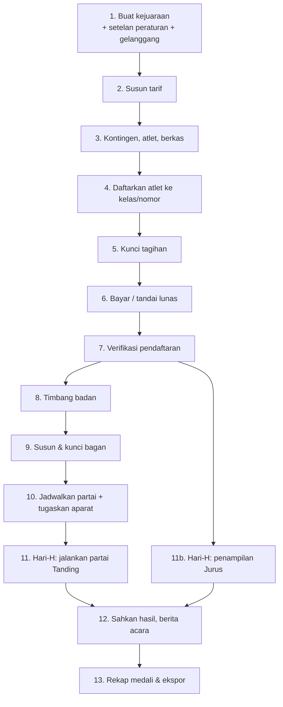

# Panduan Workflow Penggunaan Aplikasi

> Urutan lengkap memakai aplikasi dari kejuaraan masih kosong sampai medali terbagi, disusun per tahap. Tiap tahap menyebut **siapa** yang mengerjakan, **di menu mana**, **apa syaratnya**, dan **apa tanda tahap itu selesai**.
>
> Dokumen pendamping:
> - [`INSTALASI-LAN.md`](INSTALASI-LAN.md) — memasang server (sekali saja, sebelum semua ini)
> - [`PANDUAN-OPERASIONAL.md`](PANDUAN-OPERASIONAL.md) — naskah singkat hari-H: siapa berdiri di mana, urutan menyalakan sistem, setup vMix
> - [`TUNNELING.md`](TUNNELING.md) — konfigurasi live score publik
> - [`PARAMETER-PERATURAN.md`](PARAMETER-PERATURAN.md) — asal-usul tiap angka peraturan di Setelan Peraturan

> **Mau langsung ke bagian hari-H?** `php artisan silat:simulasi` menyusun satu kejuaraan yang seluruh Tahap 1–10 di bawah sudah selesai — akun tiap peran, tarif, peserta, tagihan lunas, bagan terkunci, jadwal, aparat. Rinciannya di [Lampiran: kejuaraan siap-uji](#lampiran--kejuaraan-siap-uji).

---

## Peta alur



**Tiga gerbang yang tidak bisa dilompati** — sistem menolak, bukan sekadar mengingatkan:

| Gerbang | Aturan yang ditegakkan |
|---|---|
| Verifikasi | Pendaftaran tidak bisa disahkan sebelum **tagihan kontingennya lunas** dan **berkas wajib tiap atlet lengkap** |
| Bagan | Hanya pendaftaran berstatus **Terverifikasi** yang masuk bagan; minimal **2 peserta** per kelas |
| Pengesahan Jurus | Ditolak kalau jumlah juri yang menilai **kurang dari setelan** atau **ganjil** (Pasal 16.1.b), kecuali penampilan didiskualifikasi |

---

## Peran dan menu yang bisa dibuka

Menu di sidebar muncul-hilang mengikuti peran akun yang sedang login. Kalau satu menu tidak terlihat, penyebabnya hampir selalu peran, bukan bug.

| Peran | Menu utama yang terbuka | Panel gelanggang |
|---|---|---|
| Operator IT | Seluruh administrasi kejuaraan (Kejuaraan, Gelanggang, Setelan Peraturan, Pengguna, Kontingen, Verifikasi, Tarif, Bendahara, Timbang badan, Bagan, Jadwal, Rekap) + papan tampilan gelanggang, panel Operator Jurus, pengajuan VAR, Overlay Siaran | `…/panel/papan` — tidak memegang timer maupun jalannya partai |
| Official Kontingen | Kontingen (miliknya sendiri), atlet, pendaftaran, tagihan | — |
| Pengendali Gelanggang | Panel Kendali: partai aktif, timer, perpindahan babak, buka babak susulan | `/gelanggang/{arena}/panel/kendali` |
| Ketua Pertandingan | Jadwal, penugasan aparat, keberatan, Kategori Jurus, pengesahan hasil, banding Protes Manajer, ringkasan lintas gelanggang — **memimpin partai** (pembinaan, teguran, peringatan, hitungan teknik), **meninjau dan membatalkan nilai**, **pengurangan 0.50 Jurus**, dan **memutus protes VAR** | `…/panel/ketua`, `…/panel/wasit`, `…/panel/dewan-juri`, `…/panel/komisi-protes` |
| Juri | PWA Juri, panel Juri Jurus | `…/panel/juri` |

**Akun adalah kursi, bukan orang.** Sejak penugasan aparat pindah ke gelanggang, satu akun mewakili satu kursi di satu matras sepanjang hari — namailah demikian: "Wasit Gelanggang A", "Juri 1 Gelanggang A", "Dewan Gelanggang B". Siapa pun yang duduk di kursi itu memakai akun itu, dan panitia tidak perlu menugaskan ulang apa pun saat petugasnya bertukar sif.

Lima peran. **Tiga peran matras — Wasit, Dewan Wasit Juri, dan Wasit Komisi Protes — lebur ke Ketua Pertandingan** (September 2026). Ketiganya sudah memegang hampir seluruh kewenangan yang sama dengan Ketua; yang belum cuma satu, `pengurangan-jurus.create`, dan itu ikut pindah. Siapa yang memimpin partai mana ditentukan **penugasan per gelanggang**, bukan perannya — satu kejuaraan tetap menjalankan beberapa wasit sekaligus di matras berbeda, dan nama akunnya yang membedakan ("Wasit Gelanggang A").

**Juri tidak ikut lebur.** Ia menilai, dan yang dinilainya diadu dengan penilaian juri lain; peran yang sekaligus menilai dan mengesahkan hasilnya sendiri membuat konsensus kehilangan artinya.

Tiga jabatan meja pra-acara — Sekretaris, Bendahara, dan Petugas Timbang Badan — dilebur lebih dulu jadi Sekretariat Pertandingan, lalu **Sekretariat itu sendiri lebur ke Operator IT** (September 2026): di kejuaraan yang dilayani aplikasi ini, yang menerima pendaftaran dan yang memasang papan skor orang yang sama, dan dua peran untuk satu orang cuma membuat separuh kewenangannya tertinggal di akun yang salah. **Delegasi Teknik** dihapus; wewenangnya dipegang Ketua Pertandingan (lihat catatan banding di Tahap 12). Peran bawaan boilerplate `admin` dan `user` ikut dibuang — keduanya nol pengguna dan tidak dirujuk kode mana pun.

Yang TIDAK ikut ke Operator IT: menyunting struktur hak akses itu sendiri (Peran, Permission, Resource, Pemetaan Key selain melihat). Peran yang boleh menyunting perannya sendiri bisa menaikkan haknya sampai setara super-admin, dan itu menghapus arti seluruh pembagian ini — yang dipakai akun super-admin.

**Pengendali Gelanggang** adalah peran baru, dan ia mengambil dua hal dari Operator IT: timer beserta perpindahan babak, dan pemilihan partai yang sedang dimainkan gelanggang. Operator IT turun jadi **papan tampilan** — skor, timer, dan nama pesilat untuk layar gelanggang, tanpa kendali. Alasannya satu: sebelum ini tidak ada konsep "partai aktif gelanggang" di basis data, jadi tiap perangkat ikut memutuskan partai mana yang dibuka.

**Panel petugas gelanggang tidak lagi menyebut partai di alamatnya.** Wasit, Juri, Dewan Wasit Juri, Komisi Protes, dan Ketua Pertandingan membuka alamat *gelanggangnya*, dan isinya berpindah sendiri begitu pengendali mengganti jadwal — tanpa layar antara, tanpa memuat ulang halaman, dan tanpa menyentuh perangkat mana pun. Yang bertugas di **tepat satu** gelanggang bahkan tidak melewati dashboard: login mendaratkannya langsung di panelnya. `?dashboard=1` selalu tersedia bagi yang juga memegang peran lain.

Satu akun boleh memegang lebih dari satu peran — lazim di turnamen kecil, dan tidak perlu akun terpisah untuk tiap topi.

---

# Bagian A — Pra-acara

## Tahap 1 — Buat kejuaraan

**Siapa:** Operator IT · **Menu:** Kejuaraan → Tambah

1. Isi nama, penyelenggara, tanggal mulai–selesai, tempat. Status awal **Draf**.
2. Simpan, lalu buka kejuaraan itu — ia menjadi **kejuaraan aktif** di sidebar, dan seluruh menu di bawahnya (Peserta, Pertandingan, Keuangan) mengikutinya. Kejuaraan aktif diingat per sesi; bila belum pernah membuka satu pun, sistem memakai kejuaraan berstatus Berjalan atau Draf yang terbaru.
3. Master data (golongan usia, kelas tanding, nomor Jurus) tersusun otomatis dari naskah 2025 saat kejuaraan dibuat. Tidak perlu diketik ulang.

**Selesai bila:** kejuaraan muncul di sidebar sebagai "Kejuaraan aktif".

### 1a. Setelan peraturan

**Menu:** Kejuaraan aktif → Setelan peraturan

Yang paling sering perlu disesuaikan:

| Setelan | Bawaan | Kapan diubah |
|---|---|---|
| Jumlah juri Tanding | 3 | Hampir tidak pernah — Pasal 16.1.a |
| Ambang sepakat | 2 dari 3 | Boleh diubah; naskah tidak mengaturnya |
| Window konsensus | 2000 ms | Naikkan bila jaringan venue lambat (maksimal 10000 ms) |
| Durasi babak & istirahat | Ikut golongan usia | Untuk uji coba/latihan boleh dipendekkan |
| Jumlah juri Jurus | 6 | Minimal 4, **wajib genap** |

Tiap kolom punya teks bantuan yang menyebut pasalnya. Yang tidak punya rujukan pasal ditandai terang-terangan sebagai keputusan implementasi — rinciannya di [`PARAMETER-PERATURAN.md`](PARAMETER-PERATURAN.md).

### 1b. Gelanggang

**Menu:** Kejuaraan aktif → Gelanggang

Tambahkan satu gelanggang per matras yang benar-benar dipakai. **Catat `id` tiap gelanggang** dari URL-nya — angka itu dipakai untuk URL overlay vMix dan live score publik.

**Tetapkan operatornya lewat tombol Operator di tiap baris gelanggang.** Operator hanya bisa menjalankan timer dan mengakhiri partai di gelanggang yang ditugaskan kepadanya, jadi gelanggang tanpa operator tidak bisa dijalankan sama sekali — daftarnya menandai keadaan itu dengan "belum ada operator" berwarna merah. Penugasannya berlaku sepanjang kejuaraan, termasuk untuk partai yang dijadwalkan kemudian, jadi cukup sekali di awal.

## Tahap 2 — Susun tarif

**Siapa:** Operator IT · **Menu:** Kejuaraan aktif → Tarif

1. Isi matriks **kategori × golongan usia** — misal Tanding Dewasa Rp150.000, Jurus Tunggal Remaja Rp125.000.
2. Isi **biaya tetap kontingen** bila ada (dikenakan sekali per kontingen, bukan per atlet).
3. Nomor beregu (Ganda, Regu) ditagih **per tim**, bukan per orang — sistem yang menghitung, tidak perlu dibagi manual.

**Selesai bila:** tiap kombinasi kategori × golongan usia yang akan dipertandingkan sudah punya nominal. Tarif yang kosong berarti pendaftaran ke sana bernilai Rp0.

> Ubah tarif selagi tagihan kontingen masih **Draf**. Tagihan yang sudah dikunci tidak ikut berubah.

## Tahap 3 — Kontingen dan atlet

**Siapa:** Operator IT (mendaftarkan kontingen) → Official Kontingen (mengisi atlet)

1. **Operator IT** membuka Peserta → Kontingen → Tambah: nama kontingen, daerah, kontak, dan **akun official** yang berhak mengelolanya.
2. **Official** login, membuka kontingennya, lalu menambahkan atlet: nama, jenis kelamin, tanggal lahir, berat klaim, foto.
3. Tiap atlet mengunggah **berkas wajib** — Bukti umur dan Surat keterangan sehat. Format: jpg, jpeg, png, atau pdf.

**Selesai bila:** semua atlet punya berkas lengkap. Berkas yang kurang akan memblokir verifikasi di Tahap 7, dan pesannya menyebut nama atlet serta jenis berkas yang hilang.

## Tahap 4 — Daftarkan atlet ke kelas / nomor

**Siapa:** Official Kontingen · **Menu:** kontingen → Pendaftaran

- **Tanding:** pilih atlet, pilih kelas tanding. Sistem menolak bila jenis kelamin atau golongan usia tidak cocok, atau berat klaim di luar rentang kelas.
- **Jurus:** pilih nomor (Tunggal, Tunggal Bebas, Ganda, Regu A/B, Solo Kreatif), lalu pilih atlet sebanyak yang dibutuhkan nomor itu.

Tiap pendaftaran yang dibuat langsung menambah baris di tagihan kontingen. Selama tagihan masih **Draf**, pendaftaran boleh ditambah dan dihapus bebas — nominalnya ikut menyesuaikan sendiri.

**Selesai bila:** semua atlet sudah punya kelas/nomor, dan official menekan **Ajukan** pada tiap pendaftaran (status berubah jadi *Diajukan* — masuk antrean pemeriksaan panitia).

## Tahap 5 — Kunci tagihan

**Siapa:** Official Kontingen · **Menu:** kontingen → Tagihan → **Kunci tagihan dan lanjut bayar**

Menekan Kunci berarti:
- Nominal tagihan **dibekukan** pada angka detik itu.
- **Pendaftaran kontingen ikut beku** — tidak bisa ditambah atau dihapus lagi sampai pembayaran selesai atau dibatalkan.

Kalau ternyata masih ada atlet yang harus ditambahkan, tekan **Batalkan sesi pembayaran** untuk mengembalikan tagihan ke Draf, lalu kunci ulang setelah beres.

## Tahap 6 — Pembayaran

**Dua jalur, pilih salah satu:**

**a. Midtrans (butuh internet).** Official menekan Bayar, diarahkan ke halaman Midtrans. Status lunas hanya berubah lewat **webhook terverifikasi** — kembali ke aplikasi dari halaman pembayaran saja tidak pernah mengubah status apa pun. Ini disengaja: parameter redirect gampang dipalsukan.

**b. Pembayaran manual** — transfer bank, tunai di sekretariat, atau apa pun di luar sistem.

**Siapa:** Operator IT · **Menu:** Keuangan → Bendahara → pilih tagihan → **Tandai lunas**

Wajib diisi: nominal, keterangan, dan **unggah bukti** (jpg/jpeg/png/pdf). Tercatat di jejak audit dan dibedakan tegas dari pembayaran gateway.

**Selesai bila:** tagihan berstatus **Lunas**. Sebelum ini, verifikasi tidak akan jalan.

## Tahap 7 — Verifikasi pendaftaran

**Siapa:** Operator IT · **Menu:** Peserta → Verifikasi

Tiap pendaftaran berstatus *Diajukan* ditinjau satu per satu:

- **Setujui** → status **Terverifikasi**. Hanya yang berstatus ini yang berhak masuk bagan.
- **Tolak** → wajib menuliskan alasan; official melihat alasannya di portalnya.
- **Tinjau ulang** → mengembalikan pendaftaran yang sudah diputus ke antrean.

Sistem menolak persetujuan kalau tagihan belum lunas atau berkas atlet belum lengkap, dan pesan penolakannya menyebut persis apa yang kurang.

## Tahap 8 — Timbang badan

**Siapa:** Operator IT · **Menu:** Peserta → Timbang badan

1. Cari atlet, masukkan berat aktual. Waktu penimbangan distempel server.
2. Sistem otomatis membandingkan dengan rentang kelas yang didaftarkan: **lolos** atau **gugur**.
3. Atlet yang gugur berubah status menjadi *Gugur* dan tidak ikut masuk bagan.
4. **Penimbangan ulang** dicatat sebagai baris baru, tidak menimpa yang lama. Lolos setelah sebelumnya gugur akan memulihkan status pendaftaran — kesempatan kedua tetap terekam jejaknya.

## Tahap 9 — Susun dan kunci bagan

**Siapa:** Operator IT / Ketua Pertandingan · **Menu:** Pertandingan → Bagan

1. Pilih kelas tanding. Sistem menampilkan berapa peserta sah yang tersedia.
2. Pilih **mode bagan** di sebelah tombol Susun — per kelas, bukan sekali untuk seluruh kejuaraan:

   | Mode | Ukuran bagan | Babak pertama |
   |---|---|---|
   | **Gugur** (bawaan) | dibulatkan ke pangkat dua: 8, 16, 32… | tempat yang tersisa jadi bye, disebar merata; yang lawannya bye langsung diluluskan |
   | **Pemasalan** | seukuran jumlah peserta, tanpa dibulatkan | seluruh peserta bertanding; kalau jumlahnya ganjil, peserta di tempat terakhir melenggang |

   Pemasalan dipakai kejuaraan usia dini, tempat yang dituju adalah semua anak naik matras — bukan separuh peserta yang melenggang karena kebetulan bagannya harus 16. Yang perlu diketahui sebelum memilihnya: pada jumlah peserta **ganjil**, tempat terakhir bisa melenggang lebih dari satu babak (sembilan peserta: melenggang tiga kali, lalu bertanding sekali di final). Untuk jumlah genap, hal itu tidak terjadi sama sekali.

3. **Susun** — acak atau berurutan.
4. **Tukar** slot secara manual bila undian perlu diatur (memisahkan satu kontingen, misalnya).
5. **Kunci** setelah bagan disahkan. Mode hanya bisa diubah lewat susun ulang, dan susun ulang mengacak undian dari nol.

**Setelah dikunci**, penyusunan ulang wajib beralasan dan tercatat di jejak audit. Kunci bagan sebelum hari-H, bukan pada pagi harinya.

## Tahap 10 — Jadwal dan penugasan aparat

**Menu:** Pertandingan → Jadwal

1. **Tetapkan** tiap partai ke gelanggang beserta waktu tayangnya. Partai yang belum punya dua peserta (menunggu pemenang babak sebelumnya) belum bisa dijadwalkan — normal.
2. Sistem memperingatkan bila satu atlet terjadwal di dua gelanggang pada waktu berdekatan.
3. Tugaskan aparat **per gelanggang**, dan hanya di sana: buka Pertandingan → Gelanggang → tombol **Aparat**, lalu tetapkan Wasit, Juri 1–3, Dewan Wasit Juri, Komisi Protes, dan Ketua Pertandingan untuk gelanggang itu. Penugasan berlaku sepanjang hari — petugas yang duduk di kursi yang sama tidak perlu ditugaskan ulang tiap partai. Kursi yang orangnya belum datang boleh dikosongkan dan diisi belakangan.
4. Baris **`match_officials` tetap ditulis**: saat pengendali menunjuk sebuah partai, isi kursi gelanggang disalin ke partai itu. Berita acara tetap menyebut siapa bertugas di partai mana, dan nomor juri pada tiap nilai masuk tetap dibaca dari sana.
5. **Satu orang, satu kursi, satu gelanggang.** Formulirnya menolak orang yang sudah memegang kursi di gelanggang lain — kursi berlaku sepanjang hari, jadi orang yang sama di dua matras berarti satu kursi pasti kosong begitu keduanya berjalan bersamaan.
6. Layar penugasan aparat **per partai dibuang** (September 2026). Empat baris penugasan dikali empat puluh partai adalah beban yang tidak menghasilkan apa pun yang tidak sudah dijawab kursi gelanggang.

**Selesai bila:** partai-partai babak pertama sudah punya gelanggang dan waktu, dan tiap gelanggang punya aparat lengkap beserta Pengendali Gelanggangnya. Lencana di halaman Jadwal membaca kursi gelanggang untuk partai yang belum pernah ditayangkan, jadi "Aparat lengkap" di sana berarti matrasnya siap — bukan partainya sudah ditugaskan satu per satu.

---

# Bagian B — Hari-H

> Ringkasan langkah menyalakan sistem, pembagian posisi petugas, dan setup vMix ada di [`PANDUAN-OPERASIONAL.md`](PANDUAN-OPERASIONAL.md). Bagian ini menjelaskan alur di dalam aplikasinya.

## Tahap 11 — Menjalankan satu partai Tanding

Empat panel berjalan bersamaan untuk satu partai yang sama:

| Panel | URL | Dipegang |
|---|---|---|
| Kendali | `…/gelanggang/{arena}/panel/kendali` | Pengendali Gelanggang |
| Papan tampilan | `…/gelanggang/{arena}/panel/papan` | Operator IT |
| Wasit | `…/gelanggang/{arena}/panel/wasit` | Ketua Pertandingan (peran Wasit lebur ke sana) |
| Juri (PWA) | `…/gelanggang/{arena}/panel/juri` | Juri 1–3, HP masing-masing |
| Dewan Wasit Juri | `…/gelanggang/{arena}/panel/dewan-juri` | Ketua Pertandingan (peran Dewan lebur ke sana) |
| Komisi Protes | `…/gelanggang/{arena}/panel/komisi-protes` | Ketua Pertandingan (peran Komisi lebur ke sana) |
| Ketua Pertandingan | `…/gelanggang/{arena}/panel/ketua` | Ketua Pertandingan |

Alamatnya menyebut **gelanggang**, bukan partai — ia tidak pernah basi saat jadwal berganti. Alamat per-partai yang lama tetap hidup dan mengantar sendiri ke panel gelanggangnya; yang tidak dialihkan hanya panel Dewan Wasit Juri per-partai, karena tugasnya justru meninjau partai tertentu yang sudah selesai.

Tidak ada yang perlu mengetik alamat itu. Petugas yang ditugaskan di **tepat satu** gelanggang mendarat langsung di panelnya begitu login — tanpa melewati dashboard sama sekali. Yang memegang dua gelanggang atau lebih melihat daftar gelanggangnya, karena tidak ada dasar memilihkan salah satunya. Panel-panel ini memang tidak ada di sidebar: satu alamat panel hanya berarti untuk satu gelanggang, sedangkan menu sidebar hanya bisa menunjuk kejuaraan.

Pengalihan itu tidak mengunci. Tiap panel menyediakan jalan kembali, dan `?dashboard=1` selalu membuka dashboard bagi yang juga memegang peran lain.

Pasang panelnya sebagai **PWA** di layar utama HP: tiap peran punya manifest sendiri yang menyebut peran dan gelanggangnya, jadi dua ikon di layar utama tidak pernah tertukar — dan `start_url`-nya menunjuk gelanggang, alamat yang tidak pernah basi.

**Urutan jalannya:**

1. **Pengendali Gelanggang** memilih partai dari antrean, lalu menekan Mulai babak. Timer berjalan di server — jam perangkat siapa pun tidak dipakai. Seluruh panel lain di gelanggang itu mengikuti pilihannya tanpa disentuh.
2. **Juri** menekan tombol nilai (pukulan 1, tendangan 2, jatuhan 3) untuk sudut merah atau biru. Nilai **hanya terbit bila ambang juri sepakat tercapai di dalam window** — misal 2 dari 3 juri menekan kombinasi yang sama dalam 2 detik. Satu tekanan hanya boleh ikut membentuk satu nilai.
3. **Wasit** menjatuhkan hukuman lewat panelnya. Tangga hukuman ditegakkan server, bukan diingat petugas:
   - Pembinaan tidak mengurangi nilai. Hitungannya **per babak** (keputusan penyelenggara, lihat `PARAMETER-PERATURAN.md`): setelah 2 pembinaan dalam satu babak, setiap pelanggaran ringan berikutnya di babak itu naik jadi Teguran, dan hitungannya kembali nol di babak berikutnya.
   - Teguran naik jadi **Peringatan I (−5)** lewat dua pemicu: teguran ketiga sepanjang partai, ATAU pelanggaran berikutnya setelah dua teguran dalam babak yang sama.
   - Peringatan berlaku seluruh partai dan tidak pernah mereset. **Peringatan III = diskualifikasi**, partai langsung berakhir.
   - Hitungan teknik: hitungan 9 disusul Teguran I, tiga hitungan beruntun dalam satu babak berarti lawan menang teknik, hitungan 10 berarti menang mutlak.
   - **Kedua pesilat jatuh dan tidak bangkit** (Pasal 11.6.c huruf b) dicatat lewat tombol "Keduanya jatuh" — bukan dua tekanan hitungan biasa. Hitungan serentak tidak menjatuhkan Teguran dan tidak mengakhiri partai; sistem justru **menawarkan** penyelesaian yang benar di panel papan: berat badan teringan bila keduanya belum bernilai di babak I, nilai terbanyak bila sudah. Yang menekan tombol akhiri tetap manusia.
   - **Protes VAR yang sedang berjalan** muncul sebagai pita satu baris di atas panel wasit, lengkap dengan sisa tenggatnya — Pasal 15 ayat 3 huruf d menyuruh Wasit ikut memutuskannya bersama Wasit Komisi Protes dan Pengawas/Dewan Wasit Juri. Tangga hukuman **tetap bisa ditekan**: pertandingan tidak selalu berhenti selama protes ditinjau. Kartu penuh berikut tombol Sah/Tidak Sah ada di panel Komisi Protes, panel Dewan Wasit Juri, dan panel Ketua Pertandingan.
4. **Pengendali** menekan Selesai babak, lalu Mulai babak berikutnya setelah istirahat. Atau mengakhiri partai lebih awal dengan sebab khusus: KO, TKO, WMP, mutlak, undur diri, cedera, WO.

   **Nilai atau hukuman yang terlewat di babak sebelumnya** dicatat lewat "Catat susulan babak N" di panel kendali. Babak berjalan dijeda selama itu, dan seluruh panel gelanggang beralih serentak — panel juri menampilkan spanduk amber besar dan mencetak nomor babak di dalam label tiap tombol nilai. Babak berjalan TIDAK menerima input selama susulan terbuka.
5. Sistem menawarkan **menang WMP** sendiri begitu selisih nilai mencapai ambang (30 di babak II/III; 20 untuk Usia Dini).

**Kalau koneksi juri putus:** tombol otomatis nonaktif dan indikator merah besar muncul. Ini disengaja — lebih baik juri tahu inputnya tidak masuk daripada nilai terbit di detik yang keliru. Begitu tersambung lagi, panel menarik ulang state penuh sendiri.

## Tahap 12 — Pengesahan hasil

**Siapa:** Dewan Juri meninjau, **Ketua Pertandingan mengesahkan** · **Panel:** Dewan Juri

1. Tinjau seluruh nilai dan hukuman yang tercatat, lengkap dengan jam dan juri pembentuknya.
2. Nilai atau hukuman yang keliru **dibatalkan**, bukan disunting — sistem membuat baris pembatal beserta alasannya, dan riwayat aslinya tetap utuh.
3. Tekan **Sahkan hasil**. Pemenang naik otomatis ke slot bagan berikutnya.
4. Cetak **Berita acara (PDF)**: skor per babak, daftar nilai, daftar hukuman, kolom tanda tangan.

> Hasil belum final sebelum disahkan. Pemenang yang muncul sebelum pengesahan bersifat sementara dan masih bisa dikoreksi.

## Tahap 11b — Menjalankan penampilan Jurus

**Menu:** Pertandingan → Kategori Jurus → pilih nomor

1. **Operator IT** menekan **Buat penampilan** — sistem membuat satu penampilan per pendaftaran terverifikasi di nomor itu.
2. Buka panel Operator penampilan, jalankan timer saat pesilat mulai.
3. **Juri Jurus** (minimal 4, wajib genap) memasukkan nilai **9.00–10.00** dari panelnya, dan mencatat pengurangan **0.01** untuk kesalahan rincian gerak, urutan, gerakan tertinggal, atau senjata terlepas tanpa menyentuh matras.
4. **Pengawas / Dewan Wasit Juri** mencatat pengurangan **0.50** dari panel Operator: waktu lewat toleransi, keluar gelanggang, senjata jatuh menyentuh lantai, pakaian tidak sesuai, menahan gerakan lebih dari 5 detik. Diskualifikasi dicatat di panel yang sama dan menghasilkan skor **0,00**.
5. **Ketua Pertandingan** mengesahkan skor akhir.

Skor akhir = **median seluruh nilai juri** (untuk jumlah genap, rata-rata dua nilai tengah) dikurangi hukuman. Bukan buang tertinggi-terendah lalu jumlahkan — itu aturan edisi lama.

## Tahap 11c — Protes VAR dan Protes Manajer

**Panel:** `/admin/turnamen/{id}/partai/{match}/keberatan`

1. Pelatih mengangkat kartu protes di pinggir gelanggang — **fisik, di luar sistem**. Jatah: 2 kartu per pertandingan Tanding, 1 kartu per penampilan Jurus.
2. **Operator IT atau Ketua Pertandingan** memasukkan protes ke sistem: pilih sudut, tuliskan kejadian yang disengketakan. Sistem menstempel waktu pertandingannya supaya rekaman video mudah ditemukan.
3. **Wasit Komisi Protes** meninjau dalam **hitung mundur 5 menit** yang ditampilkan sistem, lalu menetapkan **Sah** atau **Tidak Sah**.
4. Hasil "Tidak Sah" **membatalkan nilai atau hukuman yang disengketakan lewat baris pembatal** — skor terkoreksi sendiri, riwayat input juri tetap utuh.
5. Lewat tenggat 5 menit, sistem hanya menampilkan peringatan; prosesnya dilanjutkan manual lewat verifikasi juri yang dipimpin Ketua Pertandingan.

**Protes Manajer** (setelah hasil diumumkan) diajukan dari panel yang sama: tingkat pertama diputus **Ketua Pertandingan** (Pasal 15 ayat 4).

Banding menurut naskah diputus **Delegasi Teknik bersama Tim Medis dan satu anggota eksekutif PB IPSI**, bukan Ketua Pertandingan (Pasal 15 ayat 4 huruf c). Sistem ini melebur Delegasi Teknik ke peran Ketua Pertandingan, jadi di aplikasi banding tetap diputus dari akun itu — dan keputusannya bersifat final. Penyimpangan ini disengaja dan dicatat di sini supaya tidak dibaca sebagai isi naskah.

Protes yang **diterima wajib menyebut akibatnya** — naskah tidak menyediakan pilihan "diterima tanpa akibat" (Pasal 15 ayat 4 huruf c.e):

| Akibat | Kapan | Yang terjadi |
|---|---|---|
| **Mengubah hasil secara langsung** | Ada unsur kesengajaan dan tenaga teknis terbukti melanggar | Nilai/hukuman yang keliru dibatalkan lewat baris pembatal, pemenang dihitung ulang |
| **Menambah satu babak** | Kesalahan terbukti, bukan kesengajaan — kategori Tanding | Satu babak melebihi jumlah golongan usianya dibuka; pengesahan tertahan sampai dimainkan |
| **Penampilan kembali** | Kesalahan terbukti, bukan kesengajaan — kategori Jurus | Penampilan baru dibuat untuk pendaftaran dan tahap yang sama; yang lama tetap terekam |

Pengesahan hasil **diblokir** selama akibat protes yang diterima belum dijalankan — kalau tidak, pemenangnya naik slot bagan sebelum babak tambahannya dimainkan.

> Aplikasi tidak memutar video. Ia menandai momen, mencatat keputusan, dan menegakkan tenggat — pemutaran tetap di perangkat VAR terpisah.

---

# Bagian C — Setelah turnamen

## Tahap 13 — Rekap dan arsip

**Siapa:** Operator IT / Ketua Pertandingan · **Menu:** Pertandingan → Rekap & Laporan

Halaman ini menyusun sendiri dari hasil yang sudah disahkan:
- **Peringkat umum kontingen** — urut emas, perak, perunggu
- **Juara kelas Tanding** — perunggu diberikan ke **kedua** pesilat yang kalah di semifinal (tidak ada perebutan juara 3)
- **Juara nomor Jurus**

Tombol ekspor: **Cetak medali (PDF)**, **Ekspor medali (CSV)**, **Ekspor peserta (CSV)**, **Ekspor jadwal (CSV)**.

Terakhir, cetak berita acara tiap partai yang belum sempat dicetak, dari panel Dewan Juri masing-masing partai.

---

## Kalau tombolnya tidak muncul

| Gejala | Penyebab paling sering |
|---|---|
| Menu tidak ada di sidebar | Peran akun tidak punya izinnya — cek Manajemen Akses → Pengguna |
| Juri hanya melihat menu "Kategori Jurus" | Benar. Peran Juri hanya berhak atas penilaian dan penampilan Jurus; bagan, jadwal, dan rekap memang tertutup. Panel juri Tanding tidak ada di sidebar — login sudah mendaratkannya di sana |
| Login tidak mendarat di panel gelanggang | Akun itu belum ditugaskan di gelanggang mana pun, atau ditugaskan di dua gelanggang sekaligus — tetapkan lewat Pertandingan → Gelanggang |
| Panel menampilkan "Menunggu pengendali memilih partai" | Gelanggang itu belum punya partai aktif. Normal sebelum partai pertama dan di jeda antar kelas; panel terbuka sendiri begitu pengendali memilih |
| Timer tidak bisa dijalankan siapa pun | Gelanggang itu belum punya Pengendali Gelanggang. Jalankan `php artisan silat:pindah-pengendali`, lalu tetapkan pengendalinya lewat Pertandingan → Gelanggang |
| Tombol "Terima" protes manajer tidak berhasil | Akibatnya belum dipilih. Protes yang diterima wajib menyebut salah satu dari tiga akibat (Pasal 15 ayat 4 huruf c.e) |
| Menu Verifikasi hilang dari sidebar | `PENDAFTARAN_LEWATI_VERIFIKASI=true` di `.env` instalasi itu — pendaftaran yang diajukan langsung terverifikasi. Rutenya tetap hidup untuk pendaftaran lama yang masih berstatus Diajukan |
| Menu kejuaraan kosong semua | Belum ada kejuaraan aktif; buka satu kejuaraan dulu dari menu Kejuaraan |
| Tombol Setujui verifikasi ditolak | Tagihan kontingen belum lunas, atau ada berkas atlet yang belum diunggah |
| Bagan tidak bisa disusun | Kurang dari 2 pendaftaran berstatus Terverifikasi di kelas itu |
| Partai tidak bisa dijadwalkan | Belum punya dua peserta — masih menunggu pemenang babak sebelumnya |
| Nilai juri tidak terbit | Jumlah juri yang menekan belum mencapai ambang, atau jaraknya melewati window. Naikkan window di Setelan peraturan bila jaringan venue memang lambat |
| Tombol juri mati semua | Timer sedang tidak berjalan, atau koneksi WebSocket putus (indikator merah) |
| Pengesahan Jurus ditolak | Juri yang menilai kurang dari setelan, atau jumlahnya ganjil |
| Overlay vMix kosong | Gelanggang itu belum punya partai aktif. Pastikan alamatnya diambil dari menu Pertandingan → Overlay Siaran, bukan diketik manual |
| Menu Overlay Siaran tidak ada | Peran akun tidak punya `overlay.view` — tersedia untuk Operator IT dan Ketua Pertandingan |

---

## Lampiran — kejuaraan siap-uji

Untuk mencoba aplikasi tanpa mengetik data pra-acara satu per satu:

```bash
php artisan silat:simulasi
```

Menyusun kejuaraan **Kejuaraan Simulasi Digital Scoring** yang seluruh Tahap 1–10 sudah selesai:

| Sudah disiapkan | Isinya |
|---|---|
| Akun | 24 pengguna, satu per peran ditambah 6 juri dan 10 official, kata sandi `password` |
| Gelanggang | Gelanggang A dan B |
| Tarif | Tanding Rp150.000, Jurus Rp125.000, biaya tetap kontingen Rp250.000 |
| Peserta | 10 kontingen, 100 atlet, 100 pendaftaran, berkas wajib lengkap |
| Kelas | Tanding Dewasa kelas A–E, tiap kelas 10 putra dan 10 putri — sepuluh bagan berukuran 16, diundi acak, masing-masing 5 partai perdelapan tanpa bye |
| Keuangan | Sepuluh tagihan terkunci dan **lunas** lewat pembayaran manual berikut buktinya |
| Pertandingan | Pendaftaran terverifikasi, timbang badan lolos, bagan terkunci, 50 partai terjadwal mulai 08.00, aparat ditugaskan |

Akun yang paling sering dipakai: `operator@silat.test` (panel Gelanggang A) dan `operator2@silat.test` (Gelanggang B), `wasit1@silat.test`, `juri1@silat.test`–`juri6@silat.test`, `ketua@silat.test` (pengesahan hasil dan VAR). Daftar lengkapnya tercetak di akhir keluaran perintah.

Juri 1–3 ditugaskan ke Gelanggang A dan juri 4–6 ke Gelanggang B, jadi dua gelanggang bisa dijalankan bersamaan tanpa satu orang pun merangkap.

**Window konsensus dinaikkan ke 5 detik** (bawaan 2 detik). Uji manual dijalankan satu orang yang berpindah antar tab, dan tiga tekanan tombol tidak mungkin masuk dalam dua detik seperti tiga juri sungguhan yang duduk bersamaan. Kembalikan ke 2000 ms lewat Setelan peraturan bila ingin menguji ketatnya window yang sebenarnya.

Yang **tidak** dikerjakan seeder — dan memang inilah yang diuji: menjalankan partai, nilai juri, hukuman wasit, penampilan Jurus, protes VAR, pengesahan hasil, rekap medali. Lanjutkan dari [Bagian B](#bagian-b--hari-h).

Ulangi dari bersih:

```bash
php artisan silat:simulasi --reset
```

Perintah ini **menghapus permanen** kejuaraan simulasi beserta seluruh peserta, tagihan, bagan, dan hasilnya, lalu menyusun ulang. Kejuaraan lain tidak tersentuh — yang dihapus hanya kejuaraan ber-slug `simulasi-manual`.
