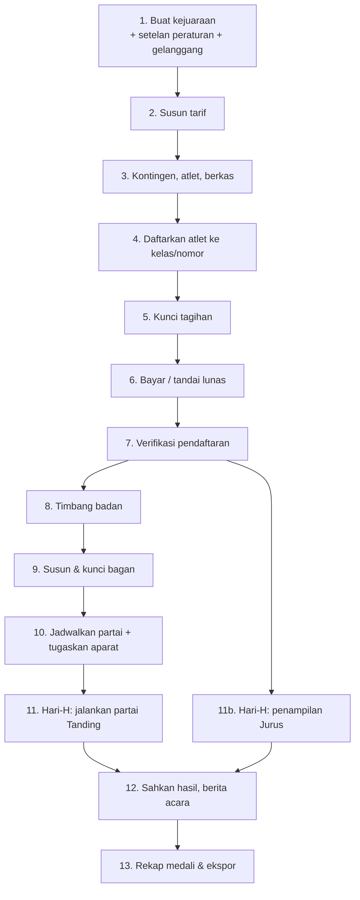

# Panduan Workflow Penggunaan Aplikasi

> Urutan lengkap memakai aplikasi dari kejuaraan masih kosong sampai medali terbagi, disusun per tahap. Tiap tahap menyebut **siapa** yang mengerjakan, **di menu mana**, **apa syaratnya**, dan **apa tanda tahap itu selesai**.
>
> Dokumen pendamping:
> - [`INSTALASI-LAN.md`](INSTALASI-LAN.md) — memasang server (sekali saja, sebelum semua ini)
> - [`PANDUAN-OPERASIONAL.md`](PANDUAN-OPERASIONAL.md) — naskah singkat hari-H: siapa berdiri di mana, urutan menyalakan sistem, setup vMix
> - [`TUNNELING.md`](TUNNELING.md) — konfigurasi live score publik
> - [`PARAMETER-PERATURAN.md`](PARAMETER-PERATURAN.md) — asal-usul tiap angka peraturan di Setelan Peraturan

> **Mau langsung ke bagian hari-H?** `php artisan silat:simulasi` menyusun satu kejuaraan yang seluruh Tahap 1–10 di bawah sudah selesai — akun tiap peran, tarif, peserta, tagihan lunas, bagan terkunci, jadwal, aparat. Rinciannya di [Lampiran: kejuaraan siap-uji](#lampiran--kejuaraan-siap-uji).

---

## Peta alur



**Tiga gerbang yang tidak bisa dilompati** — sistem menolak, bukan sekadar mengingatkan:

| Gerbang | Aturan yang ditegakkan |
|---|---|
| Verifikasi | Pendaftaran tidak bisa disahkan sebelum **tagihan kontingennya lunas** dan **berkas wajib tiap atlet lengkap** |
| Bagan | Hanya pendaftaran berstatus **Terverifikasi** yang masuk bagan; minimal **2 peserta** per kelas |
| Pengesahan Jurus | Ditolak kalau jumlah juri yang menilai **kurang dari setelan** atau **ganjil** (Pasal 16.1.b), kecuali penampilan didiskualifikasi |

---

## Peran dan menu yang bisa dibuka

Menu di sidebar muncul-hilang mengikuti peran akun yang sedang login. Kalau satu menu tidak terlihat, penyebabnya hampir selalu peran, bukan bug.

| Peran | Menu utama yang terbuka |
|---|---|
| Sekretaris Pertandingan | Kontingen, Verifikasi, Bagan, Jadwal, Rekap & Laporan |
| Bendahara Panitia | Tarif, Bendahara |
| Official Kontingen | Kontingen (miliknya sendiri), atlet, pendaftaran, tagihan |
| Petugas Timbang Badan | Timbang badan |
| Ketua Pertandingan | Jadwal, penugasan aparat, panel partai, keberatan, Kategori Jurus, pengesahan hasil |
| Operator IT | Jadwal, panel Operator partai, panel Operator Jurus, pengajuan VAR |
| Wasit | Panel Wasit (hukuman, hitungan teknik) |
| Juri | PWA Juri, panel Juri Jurus |
| Pengawas / Dewan Wasit Juri | Penugasan aparat, panel Dewan Juri, pengurangan 0.50 Jurus, keputusan VAR |
| Wasit Komisi Protes | Panel Keberatan (keputusan VAR) |
| Delegasi Teknik | Banding Protes Manajer (final), Rekap |

Satu akun boleh memegang lebih dari satu peran — lazim di turnamen kecil, dan tidak perlu akun terpisah untuk tiap topi.

---

# Bagian A — Pra-acara

## Tahap 1 — Buat kejuaraan

**Siapa:** Admin / Sekretaris Pertandingan · **Menu:** Kejuaraan → Tambah

1. Isi nama, penyelenggara, tanggal mulai–selesai, tempat. Status awal **Draf**.
2. Simpan, lalu buka kejuaraan itu — ia menjadi **kejuaraan aktif** di sidebar, dan seluruh menu di bawahnya (Peserta, Pertandingan, Keuangan) mengikutinya. Kejuaraan aktif diingat per sesi; bila belum pernah membuka satu pun, sistem memakai kejuaraan berstatus Berjalan atau Draf yang terbaru.
3. Master data (golongan usia, kelas tanding, nomor Jurus) tersusun otomatis dari naskah 2025 saat kejuaraan dibuat. Tidak perlu diketik ulang.

**Selesai bila:** kejuaraan muncul di sidebar sebagai "Kejuaraan aktif".

### 1a. Setelan peraturan

**Menu:** Kejuaraan aktif → Setelan peraturan

Yang paling sering perlu disesuaikan:

| Setelan | Bawaan | Kapan diubah |
|---|---|---|
| Jumlah juri Tanding | 3 | Hampir tidak pernah — Pasal 16.1.a |
| Ambang sepakat | 2 dari 3 | Boleh diubah; naskah tidak mengaturnya |
| Window konsensus | 2000 ms | Naikkan bila jaringan venue lambat (maksimal 10000 ms) |
| Durasi babak & istirahat | Ikut golongan usia | Untuk uji coba/latihan boleh dipendekkan |
| Jumlah juri Jurus | 6 | Minimal 4, **wajib genap** |

Tiap kolom punya teks bantuan yang menyebut pasalnya. Yang tidak punya rujukan pasal ditandai terang-terangan sebagai keputusan implementasi — rinciannya di [`PARAMETER-PERATURAN.md`](PARAMETER-PERATURAN.md).

### 1b. Gelanggang

**Menu:** Kejuaraan aktif → Gelanggang

Tambahkan satu gelanggang per matras yang benar-benar dipakai. **Catat `id` tiap gelanggang** dari URL-nya — angka itu dipakai untuk URL overlay vMix dan live score publik.

## Tahap 2 — Susun tarif

**Siapa:** Bendahara Panitia · **Menu:** Kejuaraan aktif → Tarif

1. Isi matriks **kategori × golongan usia** — misal Tanding Dewasa Rp150.000, Jurus Tunggal Remaja Rp125.000.
2. Isi **biaya tetap kontingen** bila ada (dikenakan sekali per kontingen, bukan per atlet).
3. Nomor beregu (Ganda, Regu) ditagih **per tim**, bukan per orang — sistem yang menghitung, tidak perlu dibagi manual.

**Selesai bila:** tiap kombinasi kategori × golongan usia yang akan dipertandingkan sudah punya nominal. Tarif yang kosong berarti pendaftaran ke sana bernilai Rp0.

> Ubah tarif selagi tagihan kontingen masih **Draf**. Tagihan yang sudah dikunci tidak ikut berubah.

## Tahap 3 — Kontingen dan atlet

**Siapa:** Sekretaris Pertandingan (mendaftarkan kontingen) → Official Kontingen (mengisi atlet)

1. **Sekretaris** membuka Peserta → Kontingen → Tambah: nama kontingen, daerah, kontak, dan **akun official** yang berhak mengelolanya.
2. **Official** login, membuka kontingennya, lalu menambahkan atlet: nama, jenis kelamin, tanggal lahir, berat klaim, foto.
3. Tiap atlet mengunggah **berkas wajib** — Bukti umur dan Surat keterangan sehat. Format: jpg, jpeg, png, atau pdf.

**Selesai bila:** semua atlet punya berkas lengkap. Berkas yang kurang akan memblokir verifikasi di Tahap 7, dan pesannya menyebut nama atlet serta jenis berkas yang hilang.

## Tahap 4 — Daftarkan atlet ke kelas / nomor

**Siapa:** Official Kontingen · **Menu:** kontingen → Pendaftaran

- **Tanding:** pilih atlet, pilih kelas tanding. Sistem menolak bila jenis kelamin atau golongan usia tidak cocok, atau berat klaim di luar rentang kelas.
- **Jurus:** pilih nomor (Tunggal, Tunggal Bebas, Ganda, Regu A/B, Solo Kreatif), lalu pilih atlet sebanyak yang dibutuhkan nomor itu.

Tiap pendaftaran yang dibuat langsung menambah baris di tagihan kontingen. Selama tagihan masih **Draf**, pendaftaran boleh ditambah dan dihapus bebas — nominalnya ikut menyesuaikan sendiri.

**Selesai bila:** semua atlet sudah punya kelas/nomor, dan official menekan **Ajukan** pada tiap pendaftaran (status berubah jadi *Diajukan* — masuk antrean pemeriksaan panitia).

## Tahap 5 — Kunci tagihan

**Siapa:** Official Kontingen · **Menu:** kontingen → Tagihan → **Kunci tagihan dan lanjut bayar**

Menekan Kunci berarti:
- Nominal tagihan **dibekukan** pada angka detik itu.
- **Pendaftaran kontingen ikut beku** — tidak bisa ditambah atau dihapus lagi sampai pembayaran selesai atau dibatalkan.

Kalau ternyata masih ada atlet yang harus ditambahkan, tekan **Batalkan sesi pembayaran** untuk mengembalikan tagihan ke Draf, lalu kunci ulang setelah beres.

## Tahap 6 — Pembayaran

**Dua jalur, pilih salah satu:**

**a. Midtrans (butuh internet).** Official menekan Bayar, diarahkan ke halaman Midtrans. Status lunas hanya berubah lewat **webhook terverifikasi** — kembali ke aplikasi dari halaman pembayaran saja tidak pernah mengubah status apa pun. Ini disengaja: parameter redirect gampang dipalsukan.

**b. Pembayaran manual** — transfer bank, tunai di sekretariat, atau apa pun di luar sistem.

**Siapa:** Bendahara · **Menu:** Keuangan → Bendahara → pilih tagihan → **Tandai lunas**

Wajib diisi: nominal, keterangan, dan **unggah bukti** (jpg/jpeg/png/pdf). Tercatat di jejak audit dan dibedakan tegas dari pembayaran gateway.

**Selesai bila:** tagihan berstatus **Lunas**. Sebelum ini, verifikasi tidak akan jalan.

## Tahap 7 — Verifikasi pendaftaran

**Siapa:** Sekretaris Pertandingan · **Menu:** Peserta → Verifikasi

Tiap pendaftaran berstatus *Diajukan* ditinjau satu per satu:

- **Setujui** → status **Terverifikasi**. Hanya yang berstatus ini yang berhak masuk bagan.
- **Tolak** → wajib menuliskan alasan; official melihat alasannya di portalnya.
- **Tinjau ulang** → mengembalikan pendaftaran yang sudah diputus ke antrean.

Sistem menolak persetujuan kalau tagihan belum lunas atau berkas atlet belum lengkap, dan pesan penolakannya menyebut persis apa yang kurang.

## Tahap 8 — Timbang badan

**Siapa:** Petugas Timbang Badan · **Menu:** Peserta → Timbang badan

1. Cari atlet, masukkan berat aktual. Waktu penimbangan distempel server.
2. Sistem otomatis membandingkan dengan rentang kelas yang didaftarkan: **lolos** atau **gugur**.
3. Atlet yang gugur berubah status menjadi *Gugur* dan tidak ikut masuk bagan.
4. **Penimbangan ulang** dicatat sebagai baris baru, tidak menimpa yang lama. Lolos setelah sebelumnya gugur akan memulihkan status pendaftaran — kesempatan kedua tetap terekam jejaknya.

## Tahap 9 — Susun dan kunci bagan

**Siapa:** Sekretaris Pertandingan / Ketua Pertandingan · **Menu:** Pertandingan → Bagan

1. Pilih kelas tanding. Sistem menampilkan berapa peserta sah yang tersedia.
2. **Susun** — acak atau berurutan. Bye disebar merata di babak pertama untuk jumlah peserta bukan pangkat dua, dan peserta yang lawannya bye langsung diluluskan ke babak berikutnya.
3. **Tukar** slot secara manual bila undian perlu diatur (memisahkan satu kontingen, misalnya).
4. **Kunci** setelah bagan disahkan.

**Setelah dikunci**, penyusunan ulang wajib beralasan dan tercatat di jejak audit. Kunci bagan sebelum hari-H, bukan pada pagi harinya.

## Tahap 10 — Jadwal dan penugasan aparat

**Menu:** Pertandingan → Jadwal

1. **Tetapkan** tiap partai ke gelanggang beserta waktu tayangnya. Partai yang belum punya dua peserta (menunggu pemenang babak sebelumnya) belum bisa dijadwalkan — normal.
2. Sistem memperingatkan bila satu atlet terjadwal di dua gelanggang pada waktu berdekatan.
3. Buka **Aparat** pada tiap partai, lalu tugaskan Wasit, Juri 1–3, dan Dewan Juri. Jumlah juri yang ditugaskan harus sama dengan setelan kejuaraan.

**Selesai bila:** partai-partai babak pertama sudah punya gelanggang, waktu, dan aparat lengkap.

---

# Bagian B — Hari-H

> Ringkasan langkah menyalakan sistem, pembagian posisi petugas, dan setup vMix ada di [`PANDUAN-OPERASIONAL.md`](PANDUAN-OPERASIONAL.md). Bagian ini menjelaskan alur di dalam aplikasinya.

## Tahap 11 — Menjalankan satu partai Tanding

Empat panel berjalan bersamaan untuk satu partai yang sama:

| Panel | URL | Dipegang |
|---|---|---|
| Operator | `/admin/turnamen/{id}/partai/{match}/operator` | Operator IT |
| Wasit | `/admin/turnamen/{id}/partai/{match}/wasit` | Wasit |
| Juri (PWA) | `/admin/turnamen/{id}/partai/{match}/juri` | Juri 1–3, HP masing-masing |
| Dewan Juri | `/admin/turnamen/{id}/partai/{match}/dewan-juri` | Dewan Juri |

Wasit dan juri tidak perlu mengetik alamat itu: partai yang ditugaskan kepada mereka muncul sebagai kartu **"Partai saya"** di dashboard begitu login, dan tiap barisnya menuju panel yang sesuai perannya. Panel-panel ini memang tidak ada di sidebar — satu alamat panel hanya berarti untuk satu partai, sedangkan menu sidebar hanya bisa menunjuk kejuaraan.

**Urutan jalannya:**

1. **Operator** menekan Mulai babak. Timer berjalan di server — jam perangkat siapa pun tidak dipakai.
2. **Juri** menekan tombol nilai (pukulan 1, tendangan 2, jatuhan 3) untuk sudut merah atau biru. Nilai **hanya terbit bila ambang juri sepakat tercapai di dalam window** — misal 2 dari 3 juri menekan kombinasi yang sama dalam 2 detik. Satu tekanan hanya boleh ikut membentuk satu nilai.
3. **Wasit** menjatuhkan hukuman lewat panelnya. Tangga hukuman ditegakkan server, bukan diingat petugas:
   - Pembinaan tidak mengurangi nilai, tapi akumulatif. Pelanggaran ringan **setelah 2 pembinaan** otomatis naik jadi Teguran I.
   - Teguran ketiga tidak pernah tercatat sebagai teguran — otomatis naik jadi **Peringatan I (−5)**.
   - Peringatan berlaku seluruh partai dan tidak pernah mereset. **Peringatan III = diskualifikasi**, partai langsung berakhir.
   - Hitungan teknik: hitungan 9 disusul Teguran I, tiga hitungan beruntun dalam satu babak berarti lawan menang teknik, hitungan 10 berarti menang mutlak.
4. **Operator** menekan Selesai babak, lalu Mulai babak berikutnya setelah istirahat. Atau mengakhiri partai lebih awal dengan sebab khusus: KO, TKO, WMP, mutlak, undur diri, cedera, WO.
5. Sistem menawarkan **menang WMP** sendiri begitu selisih nilai mencapai ambang (30 di babak II/III; 20 untuk Usia Dini).

**Kalau koneksi juri putus:** tombol otomatis nonaktif dan indikator merah besar muncul. Ini disengaja — lebih baik juri tahu inputnya tidak masuk daripada nilai terbit di detik yang keliru. Begitu tersambung lagi, panel menarik ulang state penuh sendiri.

## Tahap 12 — Pengesahan hasil

**Siapa:** Dewan Juri meninjau, **Ketua Pertandingan mengesahkan** · **Panel:** Dewan Juri

1. Tinjau seluruh nilai dan hukuman yang tercatat, lengkap dengan jam dan juri pembentuknya.
2. Nilai atau hukuman yang keliru **dibatalkan**, bukan disunting — sistem membuat baris pembatal beserta alasannya, dan riwayat aslinya tetap utuh.
3. Tekan **Sahkan hasil**. Pemenang naik otomatis ke slot bagan berikutnya.
4. Cetak **Berita acara (PDF)**: skor per babak, daftar nilai, daftar hukuman, kolom tanda tangan.

> Hasil belum final sebelum disahkan. Pemenang yang muncul sebelum pengesahan bersifat sementara dan masih bisa dikoreksi.

## Tahap 11b — Menjalankan penampilan Jurus

**Menu:** Pertandingan → Kategori Jurus → pilih nomor

1. **Operator IT** menekan **Buat penampilan** — sistem membuat satu penampilan per pendaftaran terverifikasi di nomor itu.
2. Buka panel Operator penampilan, jalankan timer saat pesilat mulai.
3. **Juri Jurus** (minimal 4, wajib genap) memasukkan nilai **9.00–10.00** dari panelnya, dan mencatat pengurangan **0.01** untuk kesalahan rincian gerak, urutan, gerakan tertinggal, atau senjata terlepas tanpa menyentuh matras.
4. **Pengawas / Dewan Wasit Juri** mencatat pengurangan **0.50** dari panel Operator: waktu lewat toleransi, keluar gelanggang, senjata jatuh menyentuh lantai, pakaian tidak sesuai, menahan gerakan lebih dari 5 detik. Diskualifikasi dicatat di panel yang sama dan menghasilkan skor **0,00**.
5. **Ketua Pertandingan** mengesahkan skor akhir.

Skor akhir = **median seluruh nilai juri** (untuk jumlah genap, rata-rata dua nilai tengah) dikurangi hukuman. Bukan buang tertinggi-terendah lalu jumlahkan — itu aturan edisi lama.

## Tahap 11c — Protes VAR dan Protes Manajer

**Panel:** `/admin/turnamen/{id}/partai/{match}/keberatan`

1. Pelatih mengangkat kartu protes di pinggir gelanggang — **fisik, di luar sistem**. Jatah: 2 kartu per pertandingan Tanding, 1 kartu per penampilan Jurus.
2. **Operator IT atau Ketua Pertandingan** memasukkan protes ke sistem: pilih sudut, tuliskan kejadian yang disengketakan. Sistem menstempel waktu pertandingannya supaya rekaman video mudah ditemukan.
3. **Wasit Komisi Protes** meninjau dalam **hitung mundur 5 menit** yang ditampilkan sistem, lalu menetapkan **Sah** atau **Tidak Sah**.
4. Hasil "Tidak Sah" **membatalkan nilai atau hukuman yang disengketakan lewat baris pembatal** — skor terkoreksi sendiri, riwayat input juri tetap utuh.
5. Lewat tenggat 5 menit, sistem hanya menampilkan peringatan; prosesnya dilanjutkan manual lewat verifikasi juri yang dipimpin Ketua Pertandingan.

**Protes Manajer** (setelah hasil diumumkan) diajukan dari panel yang sama: tingkat pertama diputus **Ketua Pertandingan**, banding diputus **Delegasi Teknik** dan bersifat final.

> Aplikasi tidak memutar video. Ia menandai momen, mencatat keputusan, dan menegakkan tenggat — pemutaran tetap di perangkat VAR terpisah.

---

# Bagian C — Setelah turnamen

## Tahap 13 — Rekap dan arsip

**Siapa:** Sekretaris Pertandingan / Ketua Pertandingan · **Menu:** Pertandingan → Rekap & Laporan

Halaman ini menyusun sendiri dari hasil yang sudah disahkan:
- **Peringkat umum kontingen** — urut emas, perak, perunggu
- **Juara kelas Tanding** — perunggu diberikan ke **kedua** pesilat yang kalah di semifinal (tidak ada perebutan juara 3)
- **Juara nomor Jurus**

Tombol ekspor: **Cetak medali (PDF)**, **Ekspor medali (CSV)**, **Ekspor peserta (CSV)**, **Ekspor jadwal (CSV)**.

Terakhir, cetak berita acara tiap partai yang belum sempat dicetak, dari panel Dewan Juri masing-masing partai.

---

## Kalau tombolnya tidak muncul

| Gejala | Penyebab paling sering |
|---|---|
| Menu tidak ada di sidebar | Peran akun tidak punya izinnya — cek Manajemen Akses → Pengguna |
| Juri hanya melihat menu "Kategori Jurus" | Benar. Peran Juri hanya berhak atas penilaian dan penampilan Jurus; bagan, jadwal, dan rekap memang tertutup. Panel juri Tanding dibuka dari kartu "Partai saya" di dashboard, bukan dari sidebar |
| Kartu "Partai saya" kosong | Akun itu belum ditugaskan sebagai wasit atau juri di partai mana pun — tetapkan lewat Jadwal → Aparat |
| Menu kejuaraan kosong semua | Belum ada kejuaraan aktif; buka satu kejuaraan dulu dari menu Kejuaraan |
| Tombol Setujui verifikasi ditolak | Tagihan kontingen belum lunas, atau ada berkas atlet yang belum diunggah |
| Bagan tidak bisa disusun | Kurang dari 2 pendaftaran berstatus Terverifikasi di kelas itu |
| Partai tidak bisa dijadwalkan | Belum punya dua peserta — masih menunggu pemenang babak sebelumnya |
| Nilai juri tidak terbit | Jumlah juri yang menekan belum mencapai ambang, atau jaraknya melewati window. Naikkan window di Setelan peraturan bila jaringan venue memang lambat |
| Tombol juri mati semua | Timer sedang tidak berjalan, atau koneksi WebSocket putus (indikator merah) |
| Pengesahan Jurus ditolak | Juri yang menilai kurang dari setelan, atau jumlahnya ganjil |
| Overlay vMix kosong | `arena_id` di URL salah, atau gelanggang itu belum punya partai aktif |

---

## Lampiran — kejuaraan siap-uji

Untuk mencoba aplikasi tanpa mengetik data pra-acara satu per satu:

```bash
php artisan silat:simulasi
```

Menyusun kejuaraan **Kejuaraan Simulasi Digital Scoring** yang seluruh Tahap 1–10 sudah selesai:

| Sudah disiapkan | Isinya |
|---|---|
| Akun | 21 pengguna, satu per peran, kata sandi `password` |
| Gelanggang | Gelanggang A dan B |
| Tarif | Tanding Rp150.000, Jurus Rp125.000, biaya tetap kontingen Rp250.000 |
| Peserta | 4 kontingen, 16 atlet, 14 pendaftaran, berkas wajib lengkap |
| Kelas | Tanding putra 4 peserta (bagan penuh), tanding putri 5 peserta (bagan dengan bye), Jurus Tunggal 3 peserta, Jurus Ganda 2 tim |
| Keuangan | Empat tagihan terkunci dan **lunas** lewat pembayaran manual berikut buktinya |
| Pertandingan | Pendaftaran terverifikasi, timbang badan lolos, bagan terkunci, 4 partai terjadwal, aparat ditugaskan |

Akun yang paling sering dipakai: `operator@silat.test` (panel gelanggang), `wasit1@silat.test`, `juri1@silat.test`–`juri6@silat.test`, `ketua@silat.test` (pengesahan hasil dan VAR). Daftar lengkapnya tercetak di akhir keluaran perintah.

Juri 1–3 ditugaskan ke Gelanggang A dan juri 4–6 ke Gelanggang B, jadi dua gelanggang bisa dijalankan bersamaan tanpa satu orang pun merangkap. Keenamnya dipakai bersama untuk kategori Jurus.

**Window konsensus dinaikkan ke 5 detik** (bawaan 2 detik). Uji manual dijalankan satu orang yang berpindah antar tab, dan tiga tekanan tombol tidak mungkin masuk dalam dua detik seperti tiga juri sungguhan yang duduk bersamaan. Kembalikan ke 2000 ms lewat Setelan peraturan bila ingin menguji ketatnya window yang sebenarnya.

Yang **tidak** dikerjakan seeder — dan memang inilah yang diuji: menjalankan partai, nilai juri, hukuman wasit, penampilan Jurus, protes VAR, pengesahan hasil, rekap medali. Lanjutkan dari [Bagian B](#bagian-b--hari-h).

Ulangi dari bersih:

```bash
php artisan silat:simulasi --reset
```

Perintah ini **menghapus permanen** kejuaraan simulasi beserta seluruh peserta, tagihan, bagan, dan hasilnya, lalu menyusun ulang. Kejuaraan lain tidak tersentuh — yang dihapus hanya kejuaraan ber-slug `simulasi-manual`.
